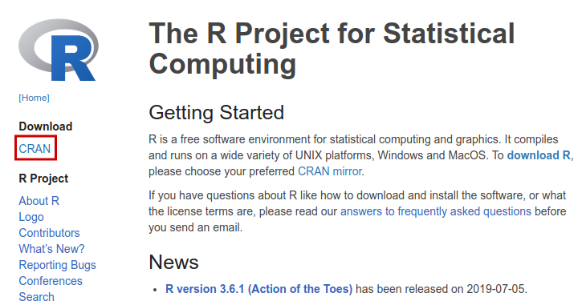
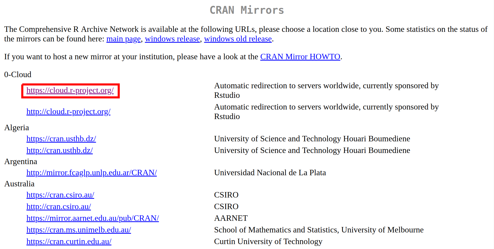
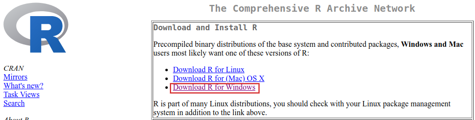
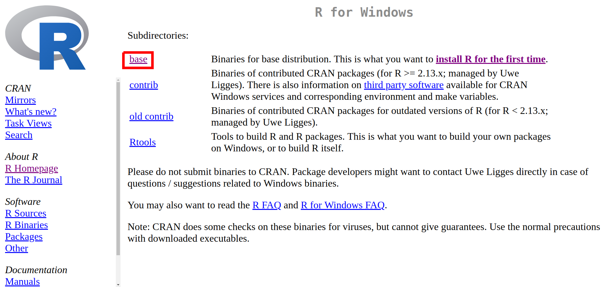
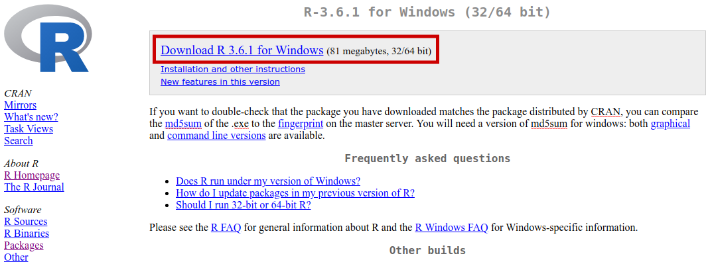

## Introduction {#introduction}

**In the digital era, information is abundant and accessible**. 

- Datasets related to Economics and Finance are widely available to the public. 
- The job market expects that a graduate student or a data analyst has learned at least one programming language that allows him/her to do his work efficiently. 

In this setup, the role and contribution of R **shine**.


## What is R

**R is a programming language specially designed to resolve statistical problems and display graphical representations of data. **

- Today, R is almost synonymous with data analysis, with a large user base and consolidated modules. 

- On the business side, large and established companies, such as _Google_ and _Microsoft_, already adopted R as the internal language for data analysis. R is maintained by [**R Foundation**](https://www.r-project.org/foundation/) and the [**R Consortium**](https://www.r-consortium.org/), a collective effort to fund projects for extending the programming language. \index{R foundation} \index{R consortium}


## Why Choose R

- **R is a mature and stable platform, continuously supported and intensively used in the industry**. 

- **Learning R is easy**. 

- **The engine of R and the interface of RStudio creates a highly productive environment**. 

- **CRAN Packages allow the user to do many different things with R**. 

- **R is compatible with different operating systems and it can interface with different programming languages**. 

- **R is free!** 


## What Can You Do With R and RStudio?

- Substitute and improve data-intensive tasks from spreadsheet-like software;

- Develop routines for managing and controlling investment portfolios and executing financial orders;

- Creating tools for calculating and reporting economic indices such as inflation and unemployment;

- Performing empirical data research using statistical techniques, such as econometric models and hypothesis testing;

- Create dynamic _websites_ with the `shiny` package, allowing anyone in the world to use a computational tool created by you; \index{shiny}

- Automate the process of writing technical reports with the **RMarkdown** technology; \index{RMarkdown} 


## Installing R {#installing}

The most direct and practical way to install R is to direct your browser to [R website](http://www.r-project.org/) and click the _Download_ link in the left side of the page, as shown in Figure \@ref(fig:website-cran-1).

```{r website-cran-1,  out.width = '100%', echo=FALSE, purl=FALSE, fig.cap= 'Initial page for downloading R' }

```

The next screen gives you a choice of the mirror to download the installation files. The CRAN repository (_R Comprehensive Archive network_) is mirrored in various parts of the world. You can choose one of the links from the nearest location to you. If undecided, just select the mirror _0-Cloud_ (see Figure \@ref(fig:website-cran-2)), which will automatically take you to the nearest location.

```{r website-cran-2, out.width = '100%', echo=FALSE, , purl=FALSE, fig.cap= 'Choosing the CRAN mirror'}

```

The next step involves selecting your operating system, likely to be  _Windows_. 

```{r website-cran-3,  out.width = '100%', purl=FALSE, echo=FALSE, purl=FALSE, fig.cap= 'Choosing the operating system'}

```

After clicking the link _Download R for Windows_, as in Figure \@ref(fig:website-cran-3), the next screen will show the following download options: _base_, _contrib_, _old.contrib_ and _RTools_. The first (_base_), should be selected. 


```{r website-cran-4,  out.width = '100%', purl=FALSE, echo=FALSE, purl=FALSE, fig.cap= 'Installation options'}

```

After clicking the link _base_, the next screen will show the link to the _download_ of the R installation file (Figure \@ref(fig:website-cran-5)). After downloading the file, open it and follow the steps in the installation screen. At this time, no special configuration is required. I suggest keeping all the default choices and simply hit _accept_ in the displayed dialogue screens. After the installation of R, it is strongly recommended to install RStudio, which will be addressed next.

```{r website-cran-5,  out.width = '100%',  purl=FALSE, echo=FALSE, purl=FALSE, fig.cap= 'Downloading R'}

```


## Installing RStudio

The base installation of R includes its own _GUI_ (graphical user interface), where we can write and execute code. However, this native interface has several limitations. RStudio substitutes the original GUI and makes access to R more practical and efficient.

The installation of RStudio is simpler than that of R. The files are available in [RStudio website](https://www.rstudio.com/). After accessing the page, click _Download RStudio_ and then _Download RStudio Desktop_. After that, just select the installation file relative to the operating system on which you will work. This option is probably _WINDOWS Vista 7/8/10_. 


## Resources in the Web

**The R community is vivid and engaging**. 

- [R-Bloggers](https://www.r-bloggers.com/) is a website that aggregates R blogs, making it easier for anyone to access and participate. I strongly recommend to sign up for the R-Bloggers feed in [RSS](https://feeds.feedburner.com/RBloggers)^[https://feeds.feedburner.com/RBloggers], [Facebook](https://www.facebook.com/rbloggers/?fref=ts)^[https://www.facebook.com/rbloggers/?fref=ts] or [Twitter](https://twitter.com/Rbloggers)^[https://twitter.com/Rbloggers]. Not only you'll be informed of what is happening in the R community, but also learn a lot by reading other people's code and articles. \index{RBloggers}

- Several conferences and user-groups are available in many countries. You can find the complete list in this [link](https://jumpingrivers.github.io/meetingsR/index.html).


## Structure and Organization

Throughout the slides, every demonstration of code will have two parts: the R code and its output. The output is nothing more than the result of the commands on the screen. All inputs and outputs code will be marked in the text with a special format. See the following example:

```{r}
# create a list
L <- list('abc', 1:5, 'dec')

# print list
print(L)
```

For the previous chunk of code, lines `L <- list('abc', 1:5, 'dec')` and `print(L)` are actual commands given to R. The output of this simple piece of code is the on-screen presentation of the contents of object `L`. The symbol `R> ` is used for any code output. Notice also that inline comments are set with the symbol `#`. Anything on the right side of `#` is not evaluated by R. These comments serve as written notes about the code.

The code can also be spatially organized using newlines. This is a common strategy around arguments of functions. The next chunk of code is equivalent to the previous and will run the exact same way. Notice how we used a new line to vertically align the arguments of function `list`. You'll soon see that, throughout the book, this type of vertical alignment is constantly used.

```{r}
# create a list
L <- list('abc', 
          1:5, 
          'dec')

# print list
print(L)
```


## Exercises

01. Use [Google](https://www.google.com/search?q=R+groups+in+my+city) to search for R groups in your region. Verify if there are frequent meetings and, if you so desire, go to one and make new friends.

02. Once you have R and RStudio installed, head over to the [CRAN package website](https://cloud.r-project.org/web/packages/available_packages_by_date.html)^[https://cloud.r-project.org/web/packages/available_packages_by_date.html] and search for computer technologies that you use in your current work. For example, if you use [Google Sheets](https://www.google.com/sheets/about/)^[https://www.google.com/sheets/about/] extensively in your work, you'll soon find there is a package in CRAN that can interact with it by creating and reading cloud-based spreadsheets. 

03. If you work in an institution with data infrastructure, talk to the IT department and seek to understand what type of data technology is being currently used. Check if it's possible, from R, to connect to the databases of your company and import the tables. No need for writing any code yet, just make sure the technology is available. 

04. Head over to the [RBloggers](https://www.r-bloggers.com/)^[https://www.r-bloggers.com/] website and search for a topic of your interest, such as, "Tennis" or "investments". Read at least two or three articles that interest you.


