## Introduction {#introduction}

```{r, include=FALSE}
my.fig.height <- 3
my.fig.width <- 4
my.out.width <- '100%'

book.site.zip <- 'https://www.msperlin.com/blog/static/afedr-files/afedr_files.zip'
```


It is important to understand how to work with R and RStudio efficiently before you develop your data analysis:

- RStudio interface;
- basic R commands;
- file extensions
- available shortcuts
- autocomplete feature of RStudio. 


## Objects in R

**In R, everything is an object, and each type of object has its properties**. 

- `Functions` as special objects, storing a pre-established manipulation of other objects

Example for the  `mean` function: 

```{r}
x <- mean(1:5, na.rm = TRUE)
```

The colon symbol (_:_) in `1:5` creates a sequence starting at 1 and ending at 5. 

**Functions are at the heart of R** and we will dedicate a large part of this course to them. 


## International and Local Formats

**decimal:** Following an international notation, the decimal point in R is defined by the period symbol (.), as in `2.5` and not a comma, as in `2,5`. 

**Latin characters:** Due to its international standard, R has problems understanding Latin characters, such as the cedilla and accents. If you can, avoid it, and do not use Latin characters in the names of your variables or files.

**date format:** Dates in R are structured according to the [ISO 8601](https://www.iso.org/iso-8601-date-and-time-format.html)^[https://www.iso.org/iso-8601-date-and-time-format.html] format. It follows the `YYYY-MM-DD` pattern, where `YYYY` is the year in four numbers, `MM` is the month and `DD` is the day. An example is `r Sys.Date()`. 


## Types of Files in R

**Files with extension _.R_**: text files containing R code. Examples: _Script-stock-research.R_, _R-fcts.R_.

**Files with extension _.RData_ or _.rds_**: files that store data in the native format. Examples: _cleaned-inflation-data.rds_, _model-results.RData_.

**Files with extension _.Rmd_ and _.md_**: files used for editing dynamic documents in the _RMarkdown_ and _markdown_  formats. Example: _investment-report.Rmd_. \index{Rmarkdown} \index{markdown}

**Files with extension _.Rproj_**: contain files for editing projects in RStudio, such as a new R package, a _shiny_ application or a book.  Example: _project-retirement.Rproj_.  \index{RStudio projects}


## Explaining the RStudio Screen

After opening RStudio, the resulting window should look like Figure \@ref(fig:RStudio1).

```{r RStudio1, purl=FALSE, echo = FALSE, out.width = my.out.width, fig.cap = 'The RStudio screen'}
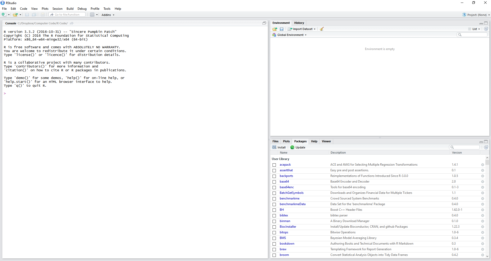
```

Note that RStudio automatically detected the installation of R and initialized your screen on the left side.

As a first exercise, click _file_, _New File_, and _R Script_. 

After the previous steps in RStudio, the resulting screen should look like the image in Figure \@ref(fig:RStudio2). The main items/panels of the RStudio screen in are: 

```{r RStudio2, purl=FALSE, echo = FALSE, out.width = my.out.width, fig.cap = 'Explaining the RStudio screen'}
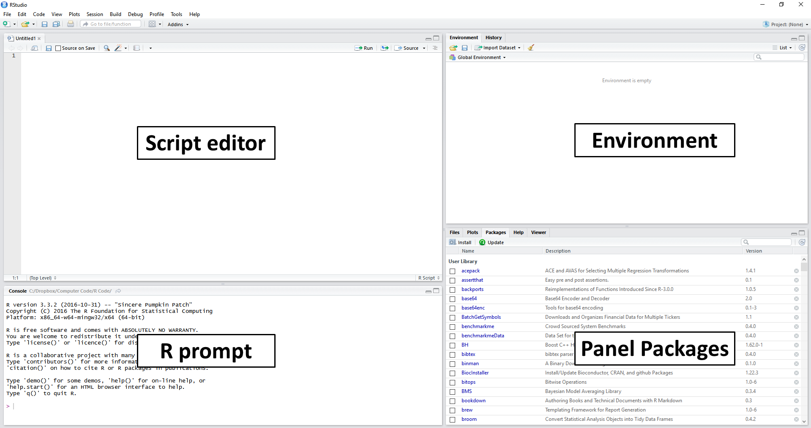
```

**Script Editor:** located on the left side and above the screen. This panel is used to write scripts and functions, mostly on files with the _.R_ extension; \index{script editor}

**R prompt:** on the left side and below the script editor. It displays the _prompt_, which can also be used to give commands to R. The main purpose of the prompt is to test code and display the results of the commands entered in the script editor; \index{prompt}

**Environment:** located on the top-right of the screen.  Shows all objects, including variables and functions currently available to the user. Also note a _History_ panel, which shows the history of commands previously executed by the user; \index{environment}

**Panel Packages:** shows the packages installed and loaded by R. Here you have four tabs: _Files_, to load and view system files; _Plots_, to view statistical figures created in R; _Help_ to access the help system and _Viewer_ to display dynamic and interactive results, such as a web page. \index{RStudio panels}

As an introductory exercise, let's initialize two objects in R. Inside the prompt (lower left side), insert these commands and press _enter_ at the end of each. 

```{r}
# set x
x <- 1

# set y
y <- 'My humble text'
```

If done correctly, notice that two objects appeared in the _environment_ panel, one called `x` with a value of 1, and another called `y` with the text content `"My humble text"`.

Now, let's show the values of `x` on the screen. To do this, type the following command:

```{r}
# print contents of x
print(x)
```

The `print` function is one of the main functions for displaying values in the _prompt_ of R. 

```{r}
# print a sequence
print(50:100)
```

Here, we use the colon symbol in `50:100` to create a sequence starting at 50 and ending at 100. 


## Running Scripts from RStudio

Now, let's combine all the previously typed codes into a single file by copying and pasting all commands into the editor's screen (upper left side). The result looks like Figure \@ref(fig:example-script).

```{r example-script,purl=FALSE,  echo = FALSE, out.width = my.out.width, fig.cap = 'Example of an R script'}
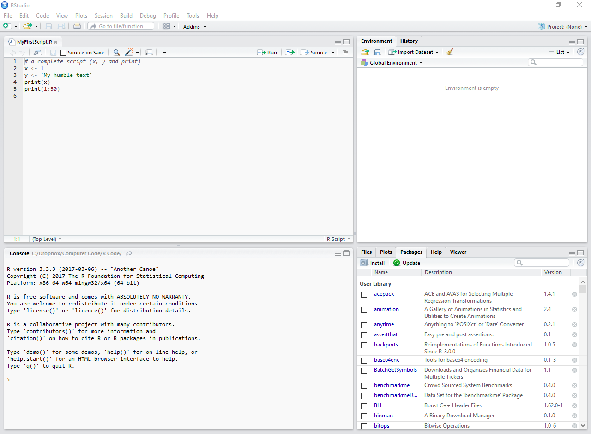
```

After pasting all the commands in the editor, save the _.R_ file to a personal folder where you have read and write permissions. 


### RStudio shortcuts

In RStudio, there are some predefined and time-saving shortcuts for running code from the editor. To execute an entire script, simply press **control + shift + s**. This is the _source_ command.  With RStudio open, I suggest testing this key combination and checking how the code saved in a _.R_ file is executed. 

Another way of executing code is with the shortcut **control + enter**, which will only execute the line where the cursor is located.

Next, I highlight these and other RStudio shortcuts, which are also very useful.

control + shift + s
: executes (source) the current RStudio file;

control + shift + enter
: executes the current file with echo, showing the commands on the prompt;

control + enter
: executes the selected line, showing on-screen commands;

control + shift + b
: executes the codes from the beginning of the file to the cursor's location;

control + shift + e
: executes the codes of the lines where the cursor is until the end of the file.


## Creating Simple Objects

One of the most basic and most used commands in R is the creation of objects. As shown in previous sections, you can define an object using the `<-` command, which is verbally translated to _assign_. For example, consider the following code: \index{assign}

```{r}
# set x
x <- 123

# set my_x, my_y and my_z in one line
my_x <- 1; my_y <- 2; my_z <- 3
```

We can read this code as _the value 123 is assigned to x_. The direction of the arrow defines where the value is stored. 


## Creating Vectors

In the previous examples, we created simple objects such as `x <- 1` and `x <- 'ABC'`. While this is sufficient to demonstrate the basic commands in R, in practice, such commands are very limited. 

Atomic vectors are created in R using the `c` command, which comes from the verb _combine_. For example, if we want to combine the values 1, 2 and 3 in a single object, we can do it with the following command: \index{base!c}

```{r}
# create numeric atomic vector
x <- c(1, 2, 3)

# print it
print(x)
```

The `c` command works the same way for any other class of object, such as _character_:

```{r}
# create character atomic vector
y <- c('text 1', 'text 2', 'text 3', 'text 4')

# print it
print(y)
```

The only restriction on the use of the `c` command is that all elements must have the same class. 


## Displaying and Formatting Output

For example, if we wanted to show the text, `The value of x is equal to 2` on-screen using a numerical object, we could do it as follows:

```{r}
# set x
x <- 2

# print customized message
cat('The value of x is', x)
```

You can also customize the screen output using specific commands. For example, if we wanted to break a line in the screen output, we could do it through the use of the reserved character `\n`:

```{r}
# set text with break line
my_text <- ' First Line,\n Second line'

# print it
cat(my_text)
```

Note that the use of `print` would not result in the same effect as this command displays the text as it is, without processing it for specific symbols:

```{r}
print(my_text)
```

Another example in the use of specific commands for text is to add a _tab_ space with the symbol `\t`. See an example next:

```{r}
# set text with tab
my_text <- 'before-> \t inside \t <-after'

# concatenate and print it!
cat(my_text)
```


### Customizing the Output

Another way to customize text output is by using specific functions to manipulate objects of class `character`. For that, there are two very useful functions: `paste` and `format`. \index{base!paste}  \index{base!format}

Function `paste` _glues_ a series of character objects. It is a very useful function and will be used intensively for the rest of the examples in this course. Consider the following example:

```{r}
# set some text objects
my_text_1 <- 'I am a text'
my_text_2 <- 'very beautiful'
my_text_3 <- 'and informative.'

# paste all objects together and print
cat(paste(my_text_1, my_text_2, my_text_3))
```

The previous result is not far from what we did in the example with the `print` function. Note, however, that the `paste` function adds a space between each text. If we did not want this space, we could use the function `paste0` as in:

```{r}
# example of paste0
cat(paste0(my_text_1, my_text_2, my_text_3))
```

Another very useful possibility with the `paste` function is to insert a text or symbol between the junction of texts. For example, if we wanted to add a comma (`,`) between each item to be pasted, we could do this by using the input option `sep` as follows:

```{r}
# example using the argument sep
cat(paste(my_text_1, my_text_2, my_text_3, sep = ', '))
```

If we had an atomic vector with all elements to be glued in a single object, we could achieve the same result using the `collapse` argument. See an example next.

```{r}
# set character object
my_text <-c('I am a text', 'very beautiful', 'and informative.')

# example of using the collapse argument in paste
cat(paste(my_text, collapse = ', '))
```

Another key feature of the `paste` command is that also works for vectors. For example, let's say I needed to create a series of text objects containing the phrase `"My value is equal to X"`, where `"X"` goes from 1 to 10. We can do the following:

```{r}
# set size and vector
my_size <- 10
my_vec <- 1:my_size

# define string vector
my_str <- paste0('My value is equal to ', my_vec)

# print it
print(my_str)
```

Going forward, command `format` is used to format numbers and dates. It is especially useful when we want to represent numbers in a more visually appealing way. By definition, R presents a set number of digits after the decimal point: \index{base!format}

```{r}
# example of decimal points in R
cat(1/3)
```

If we wanted only two digits on the screen, we could use the following code:

```{r}
# example of using the format on numerical objects
cat(format(1/3, digits=2))
```

Likewise, if we wanted to use a scientific format in the display, we could do the following:

```{r}
# example of using a scientific format
cat(format(1/3, scientific=TRUE))
```


## Finding the Size of Objects

In R, the size of an object can be checked with the use of four main functions: `length`, `nrow`, `ncol` and `dim`. \index{base!length} \index{base!nrow} \index{base!ncol} \index{base!dim}

Function `length` is intended for objects with a single dimension, such as atomic vectors:

```{r}
# create atomic vector
x <- c(2, 3, 3, 4, 2,1)

# get length of x
n <- length(x)

# display message
cat('The length of x is ', n)
```

For objects with more than one dimension, such as a matrix, use functions `nrow`, `ncol` and `dim` (dimension) to find the number of rows (first dimension) and the number of columns (second dimension). See the difference in usage below.

```{r}
# create a matrix
M <- matrix(1:20, nrow = 4, ncol = 5)

# print matrix
print(M)

# calculate size in different ways
my_nrow <- nrow(M)
my_ncol <- ncol(M)
my_n_elements <- length(M)

# display message
cat('The number of lines in M is ', my_nrow)
cat('The number of columns in M is ', my_ncol)
cat('The number of elements in M is ', my_n_elements)
```

The `dim` function shows the dimension of the object, resulting in a numeric vector as output. This function should be used when the object has more than two dimensions. In practice, however, such cases are rare as most data-related problems can be solved with a bi-dimensional representation. An example is given next:

```{r}
# get dimension of M
my_dim <- dim(M)

# print it
print(my_dim)
```

In the case of objects with more than two dimensions, we can use the `array` function to create the object and `dim` to find its size. Have a look at the next example:

```{r}
# create an array with three dimensions
my_array <- array(1:9, dim = c(3, 3, 3))

# print it
print(my_array)

# display its dimensions
print(dim(my_array))
```


## Selecting Elements from an Atomic Vector

After creating an atomic vector of a class, it is possible that the user is interested in only one or more elements of it. 

The selection of _pieces_ of an atomic vector is called indexing and it is accomplished with the use of square brackets (`[ ]`). Consider the following example:

```{r}
# set x
my_x <- c(1, 5, 4, 3, 2, 7, 3.5, 4.3)
```

If we wanted only the third element of `my_x`, we use the bracket operator as follows:

```{r}
# get the third element of x
elem_x <- my_x[3]

# print it
print(elem_x)
```

Indexing also works using vectors containing the desired locations. If we are only interested in the last and penultimate values of `my_x`, we use the following code:

```{r}
# set vector with indices
my_idx <-  (length(my_x)-1):length(my_x) 

# get last and penultimate value of my_x
piece_x_1 <- my_x[my_idx]

# print it
print(piece_x_1)
```

A cautionary note: **a unique property of the R language is that if a non-existing element of an object is accessed, the program returns the value `NA` (_not available_)**. See the next example code, where we attempt to obtain the fourth value of a vector with only three components.

```{r}
# set object
my_vec <- c(1, 2, 3)

# print non-existing fourth element
print(my_vec[4])
```

This is important because `NA` elements are contagious. That is, anything that interacts with `NA` will also become `NA`. **You should always pay attention every time that `NA` values are found unexpectedly**.


## Removing Objects from the Memory

For example, given an object `x`, we can delete it from memory with the command `rm`, as shown next: \index{base!rm}

```{r}
# set x
x <- 1

# remove x
rm('x')
```

After executing the command `rm('x')`, the value of `x` is no longer available in the R session. 

In practical situations, however, it is desirable to clean up all the memory used by all objects created in R. We can achieve this goal with the following code:

```{r, eval=FALSE}
rm(list = ls())
```


## Displaying and Setting the Working Directory

Like other programming platforms, **R always works in a directory**. If no directory is set, a default value is used when R starts up. **It is a good programming policy is to change the working directory to the same place where the _script_ is located**.

The simplest way of checking the current working directory is looking at RStudio's prompt panel. At the top, in a small font and just below the word "Console", you'll see the working path. Using code, we can check the current working directory with function `getwd`: \index{base!getwd}

```{r}
# get current dir
my_dir <- getwd()

# display it
print(my_dir)
```

The change of the working directory is performed with the `setwd` command:

```{r eval=FALSE}
# set where to change directory
my_d <- 'C:/My Research/'

# change it
setwd(my_d)
```

After changing the directory, importing and saving files in the _C:/My Research/_ folder will be a lot easier. 


## Canceling Code Execution

Whenever R is running some code, a visual cue in the shape of a small red circle in the right corner of the _prompt_ will appear. This button is not only an indicator of running code but also a shortcut for canceling its execution. 

Another way to cancel an execution is to point the mouse to the _prompt_ and press the _escape_ (_esc_) button from the keyboard.

To try it out, run the next chunk of code in RStudio and cancel its execution using _esc_.

```{r, tidy=FALSE, eval=FALSE}
for (i in 1:100) {
  cat('\nRunning code (please make it stop by hitting esc!)')
  Sys.sleep(1)
}
```

In the previous code, we used a `for` loop and function `Sys.sleep` to display the message `'\nRunning code (please make it stop by hitting ESC!)'` one hundred times, every second.


## Code Comments

In R, comments are set using the hashtag symbol `#`. Anything after this symbol will not be processed by R. This gives you the freedom to write whatever you want within the script. An example:

```{r}
# this is a comment (R will not parse it)
# this is another comment (R will again not parse it)

x <- 'abc' # this is an inline comment
```

Comments are an effective way to communicate any important information that cannot be directly inferred from the code. In general, you should avoid using comments that are too obvious or too generic:

```{r, eval=FALSE}
# read CSV file
df <- read.csv('data/data_file.csv')
```

As you can see, it is quite obvious from the line `df <- read.csv('..')` that the code is reading a .csv file. 

A better approach at commenting would be to set the author, description of the script and better explain the origin and last update of the data file. Have a look:

```{r, eval=FALSE, tidy=FALSE}
# Script for reproducing the results of JOHN (2019)
# Author: Mr data analyst (dontspamme@emailprovider.com)
# Last script update: 2020-01-10
#
# File downloaded from www.site.com/data-files/data_file.csv
# The description of the data goes here
# Last file update: 2020-01-10

df <- read.csv('data/data_file.csv')
```


Another productive use of comments is to set sections in the code, such as in:

```{r, eval=FALSE, tidy=FALSE}
# Script for reproducing the results of JOHN (2019)
# Author: Mr data analyst (dontspamme@emailprovider.com)
# Last script update: 2020-01-10
#
# File downloaded from www.site.com/data-files/data_file.csv
# The description of the data goes here
# Last file update: 2020-01-10

# Clean data -------------------------
# - remove outliers
# - remove unnecessary columns

# Create descriptive tables ----------


# Estimate models --------------------


# Report results ---------------------
```

The use of a long line of dashes (-) at each section of the code is intentional. It causes RStudio to identify and bookmark the sections, with a link to them at the bottom of the script editor.


## Looking for Help

A common task in the use of R is to seek help. Even advanced users often seek instructions on specific tasks, whether it is to better understand the details of some functions or simply to study a new procedure.

You can get help by using the _help_ panel in RStudio or directly from the _prompt_. Simply enter the question mark next to the object on which you want help, as in `?mean`. In this case, object `means` is a function and the use of the `help` command will open a panel on the right side of RStudio.

In R, the help screen of a function is the same as shown in Figure \@ref(fig:example-help). 

```{r example-help, purl=FALSE, echo=FALSE, out.width = '100%', fig.cap = 'Help screen for function mean'}
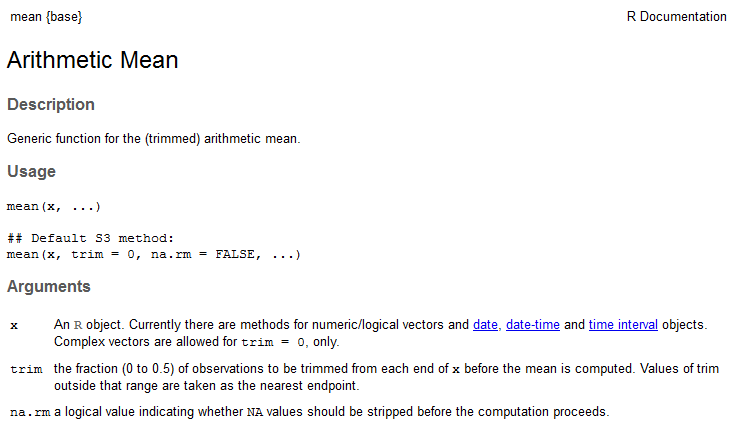
```

If we are looking for help for a given text and not a function name, we can use double question marks as in `??"standard deviation"`. This operation will search for the occurrence of the term in all packages of R and it is very useful to learn how to perform a particular task. 


## R Packages

**One of the greatest benefits of using R is its package collection. **

- When R initializes, packages `stats`, `graphics`, `grDevices`, `utils`, `datasets`, `methods` and `base` are loaded by default. 

- R packages can be accessed and installed from different sources. **CRAN is the official repository of R and it is built by the community**. 


The complete list of packages available on CRAN, along with a brief description, can be accessed at the [packages section of the R site](https://cran.r-project.org/web/packages/available_packages_by_date.html)

Another important source for finding packages is the [CRAN Task Views](https://cran.r-project.org/web/views/). There you can find the collection of noteworthy packages for a given area of expertise. See the _Task Views_ screen in Figure \@ref(fig:TaskViews).

```{r TaskViews, purl=FALSE, echo=FALSE, out.width = '100%', fig.cap = 'Task View screen' }
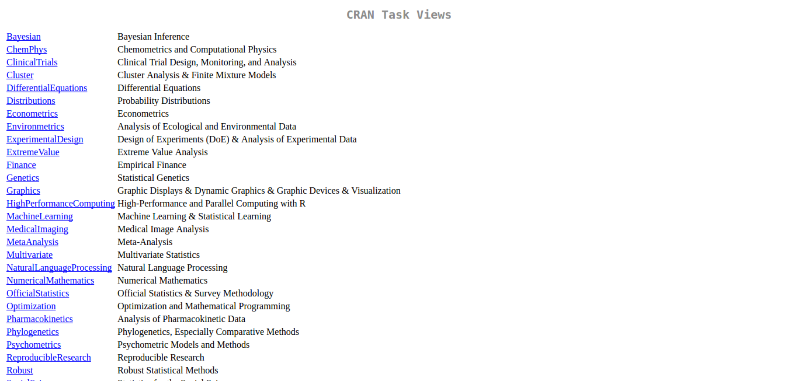
```

A popular alternative to CRAN is [Github](https://github.com/)^[https://github.com/]. Unlike the former, Github imposes soft restrictions on the code and, because of this and its version control system, it is a popular choice by developers. 

In practice, it is very common for developers to maintain a development version on Github and the official version in CRAN. When the development version reaches a certain stage of maturity, it is then sent to CRAN.

To find out the current amount of packages on CRAN, type and execute the following commands in the prompt:

```{r}
# get a matrix with available packages
df_cran_pkgs <- available.packages()

# find the number of packages
n_cran_packages <- nrow(df_cran_pkgs)

# print it
print(n_cran_packages)
```

Currently, `r Sys.time()`, there are `r n_cran_packages` packages available on the CRAN servers, a very impressive mark for the community of developers as a whole. 


### Installing Packages from CRAN

To install a package, simply use the command `install.packages`. 

```{r eval=FALSE}
# install package readr
install.packages("readr")
```

That's it! After executing this simple command, package `readr` and all of its dependencies will be installed and the functions related to the package will be ready for use once the package is loaded in a script. 


### Installing Packages from Github

To install a package hosted in Github, you must first install the _devtools_ package, available on CRAN: \index{devtools}

```{r eval=FALSE}
# install devtools
install.packages('devtools')
```

After that, use the function `devtools::install_github` to install a package directly from Github. In the following example, we will install the development version of package `dplyr`: \index{devtools!install\_github}

```{r eval=FALSE}
# install ggplot2 from github
devtools::install_github("hadley/dplyr")
```

Note that the username of the developer is included in the input string. In this case, the _hadley_ name belongs to the developer of `ggplot2`, Hadley Wickham. 


### Loading Packages

Within a script, use the function `library` to load a package, as in the following example. \index{base!library}

```{r eval=FALSE}
# load package BatchGetSymbols
library(BatchGetSymbols)
```

After running this command, all functions of the package will be available to the user.

Alternatively, if you use a specific package function and do not want to load all functions from the same package, you can do it with the use of double colons::`, as in the following example. \index{base!::}

```{r}
# example of using a function without loading package
fortunes::fortune(10)
```

Here, we use function `fortune` from the package `fortunes`, which shows on screen a potentially funny phrase chosen from the R mailing list.

Another way of loading a package is by using the `require` function. A call to `require` has a different behavior than a call to `library`. Whenever you try to load an uninstalled package with the `library` function, it returns an error. This means that the script stops and no further code are evaluated. As for `require`, if a package is not found, it returns an object with value `FALSE` and the rest of the code is evaluated. 

The use of `require` is left for loading up packages inside of functions. If you create a custom function that requires procedures from a particular package, you must load the package within the scope of the function. For example, see the following code, where we create a new function called `fct_example` that depends on the package `quantmod`:

```{r eval=FALSE}
fct_example <- function(x){

  require(quantmod)

	df <- getSymbols(x, auto.assign = F)
	return(df)
}
```


### Upgrading Packages

Over time, it is natural that packages available on CRAN are upgraded to accommodate new features, correct bugs and adapt to changes. 

A direct way of upgrading packages is to click the button _Update_ located in the package panel, lower right corner of RStudio, as shown in Figure \@ref(fig:RStudio-update).

```{r RStudio-update, purl=FALSE, echo=FALSE, out.width = '100%', fig.cap = 'Updating R packages'}
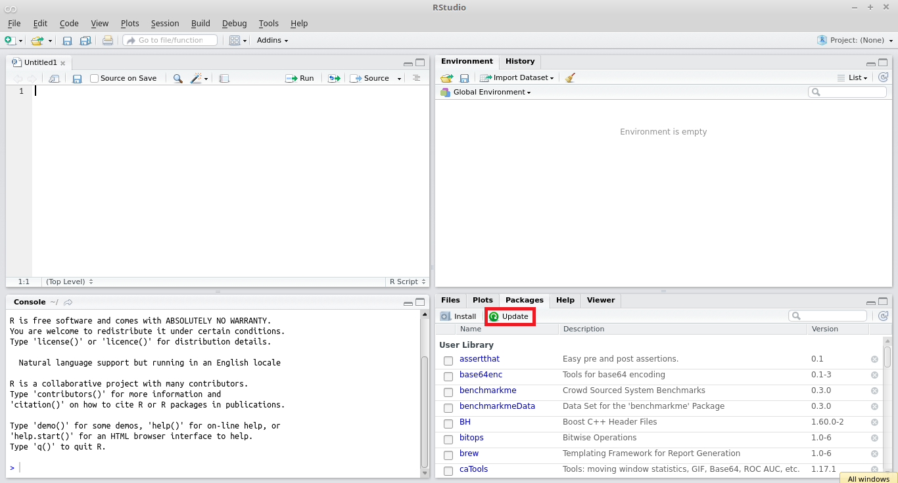
```

The user can also update packages through the prompt. Simply type command `update.packages()` and hit _enter_, as shown below. \index{base!update.packages}

```{r eval=FALSE}
# update all installed packages
update.packages()
```

The command `update.packages` compares the version of the installed packages with the versions available in CRAN. If it finds any difference, the new versions are downloaded and installed. After running the command, all packages will be synchronized with the versions available in CRAN.


## Using Code Completion with _tab_ {#autocomplete}

A very useful feature of RStudio is _code completion_. This is an editing tool that facilitates the search of:

- object names
- packages
- function arguments
- local files

After you type any first letter in the keyboard, just press _tab_ (left side of the keyboard, above _capslock_) and a number of options will appear. See Figure \@ref(fig:autocomplete-objects) where, after entering the _f_ letter and pressing _tab_, a small window appears with a list of object names that begin with that letter. \index{code completion}

```{r autocomplete-objects, purl = FALSE, echo=FALSE, out.width = '100%', fig.cap = 'Usage of autocomplete for object name'}
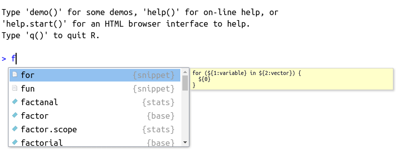
```

The autocomplete feature is self-aware and will work differently depending on where it is called. As such, it works perfectly for searching for packages. For that, type `library()` in the prompt or editor, place the cursor in between the parentheses and press _tab_. The result should look something like Figure \@ref(fig:autocomplete-packages), shown next.

```{r autocomplete-packages, purl=FALSE, echo=FALSE, out.width = '100%', fig.cap = 'Usage of autocomplete for packages' }
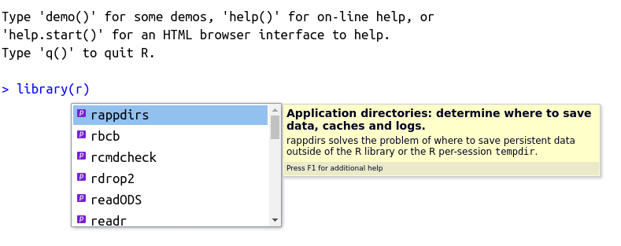
```

Note that a description of the package or object is also offered by the code completion tool. 

As mentioned in the previous section, you can also find files and folders on your computer using _tab_. To try it, write the command `my_file <- ""` in the prompt or a script, point the cursor to the middle of the quotes and press the _tab_ key. 

```{r autocomplete-files, purl=FALSE, echo=FALSE, out.width = '100%', fig.cap = 'Usage of autocomplete for files and folders'}
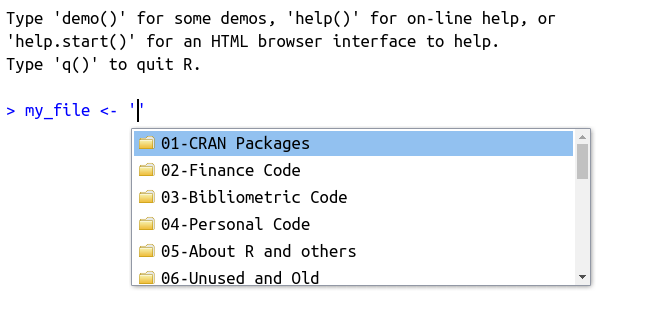
```

The use of autocomplete is also possible for finding the name and description of function arguments. To try it out, write `cat()` and place the mouse cursor inside the parentheses. After that, press _tab_. The result should be similar to Figure \@ref(fig:autocomplete-args).

```{r autocomplete-args, purl=FALSE, echo=FALSE, out.width = '75%', fig.cap = 'Usage of autocomplete for function arguments'}
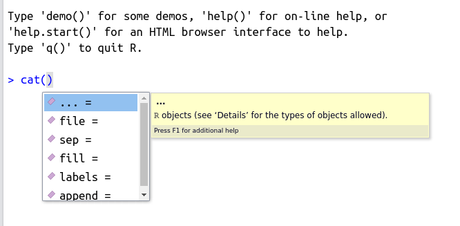
```

Likewise, you can also search for a function within a package with _tab_. For that, simply type the name of the package followed by two commas, as in `readr::`, and press _tab_. The result should be similar to Figure \@ref(fig:autocomplete-pkg-fct)

```{r autocomplete-pkg-fct, purl=FALSE, echo=FALSE, out.width = '75%', fig.cap = 'Usage of autocomplete for finding functions within a package'}
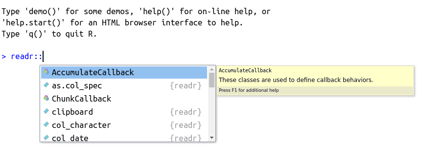
```


## Interacting with Files and the Operating System

As you are learning R, soon enough you'll find a data-related problem with a demand for interacting with files on the computer.


### Listing Files and Folders

To list files from your computer, use function `list.files`, where the `path` argument sets the directory to list the files from. 

```{r}
# list files in data folder
my_files <- list.files(path = "data", full.names = TRUE)
print(my_files)
```


To list folders (directories) on your computer, use the command `list.dirs`. See below. \index{base!list.dirs}

```{r}
# store names of directories
my_dirs <- list.dirs(recursive = F)

# print it
print(my_dirs)
```


### Deleting Files and Directories

You can delete files with command `file.remove`:

```{r}
# create temporary file
my_file <- '~/Desktop/tempfile.csv'
write.csv(x = data.frame(x = 1:10),
          file = my_file)

# delete it
file.remove(my_file)
```

Remember that you must have permission from your operating system to manipulate the hard drive and delete a file. In the previous chunk of code, the returned value `TRUE` tells us that the operation was successful.

To delete directories and all their elements, we use `unlink`:

```{r, echo=FALSE}
if (dir.exists('temp')) unlink('temp')
```


```{r}
# create temp dir
dir.create('temp')

# create a file inside of temp
my_file <- 'temp/tempfile.csv'
write.csv(x = data.frame(x=1:10),
          file = my_file)

unlink(x = 'temp', recursive = TRUE)
```


### Downloading Files from the Internet

We can also use R to download files from the Internet with function `download.file`. 

```{r}
# set link
link_dl <- 'go.microsoft.com/fwlink/?LinkID=521962'
local_file <- 'data/temp_file.xlsx' # name of local file

download.file(url = link_dl,
              destfile = local_file)
```


### Using Temporary Files and Directories

An interesting aspect of R is that every new session is linked to a temporary folder within the computer. This folder is used to store any disposable files and folders generated by R. 

The location of this directory is available with `tempdir`:

```{r}
my_tempdir <- tempdir()
print(my_tempdir)
```

The name of the temporary directory, in this case `r my_tempdir`, is randomly defined at the start of every new R session. When the computer is rebooted, all temporary directories are deleted.

The same dynamic is found for file names. If you want to use a temporary random name for some reason, use `tempfile`:

```{r}
my_tempfile <- tempfile()
cat(my_tempfile)
```

You can also set its extension and name:

```{r, eval=FALSE}
my_tempfile <- tempfile(pattern = 'temp_', 
                             fileext = '.csv')
cat(my_tempfile)
```

As a practical case of using temporary files and folders, let's _download_ the Excel worksheet from Microsoft into a temporary folder and read its content for the first five rows:

```{r}
# set link
link_dl <- 'go.microsoft.com/fwlink/?LinkID=521962'
local_file <- tempfile(fileext = '.xlsx', tmpdir = tempdir())

download.file(url = link_dl,
              destfile = local_file)

df_msft <- readxl::read_excel(local_file)

print(head(df_msft))
```


## Exercises {#exercises-basic-exercises}

01. Create a new R script, set a name and save it to a personal folder. Now, use the script to define two objects: one containing a number between 1 and 100 and another with the text of your name (eg `'John'`). Within RStudio, execute the script with RStudio keyboard shortcuts (_control + enter_ and _control + shift + enter_).

02. Within the previous script, display the following phrase in the _prompt_ of R: `"My name is .... "`. Tip: use functions `cat` and `paste0`.

03. Within the same script, print the current working directory of your R session (see function `getwd`, as in `print(getwd())`). Now, modify the working directory to your _Desktop_ area and display the following message: `'My desktop address is ....'`. Tip: use the autocomplete feature of RStudio with the tab key for quickly finding the desktop folder.

04. Use R to download the book zip file available at this [link](`r book.site.zip`)^[`r book.site.zip`]. Save it as a file in the temporary session folder (see `tempfile` function).

05. Use the `unzip` function to unzip the downloaded file from the previous exercise to a desktop folder called `'Book files`'. How many files are available? Tip: use argument `recursive = TRUE` with `list.files` to make sure you use subfolders in your search. 

06. Every time you install a new R package, all related files are locally stored in a specific directory of your computer. Using the command `Sys.getenv('R_LIBS_USER')` and `list.dirs`, list all directories in the root of this folder. How many did you find?

07. On the same subject, create a variable called `pkg_files` that contains all files in all subdirectories of the folder containing the files of the different packages available at `Sys.getenv('R_LIBS_USER')`. On average, how many files are needed for each package? 

08. Use function `install.packages` to install package `BatchGetSymbols` in your computer. After the installation, use function `BatchGetSymbols` from the same package to download price data for the IBM stock in the previous 15 days from today. Tip: You can use the function `Sys.Date()` to find out the current date and use `Sys.Date() - 15` to figure out the start of the previous 15 days from today.

09. Using the `devtools` package, install the development version of the `ggplot2` package in the [Hadley Hickman repository](https://github.com/hadley). Load the package using `library` and create a simple plot with code `qplot(y = rnorm (10), x = 1:10)`.

10. CHALLENGE - Using your programming ability with R, count the number of files in every folder in the "Documents" directory. Using the prompt, display the five folders with the largest number of files. 

