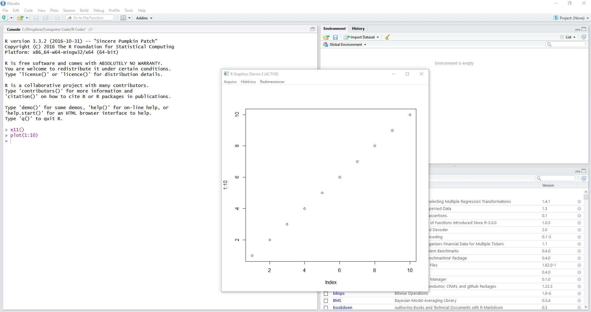

## Introduction {#introduction}

```{r, include=FALSE}
#my.fig.height <- 3
#my.fig.width <- 4
my_fig_height <- 6
my_fig_width <- 7
my.out.width <- '100%'
book.site.zip <- 'https://www.msperlin.com/blog/static/afedr-files/afedr_files.zip'

format.cash <- function(x) {
  require(scales)

  x.formatted <- dollar(x,
                        prefix = '$',
                        decimal.mark = '.',
                        big.mark = ',',
                        largest_with_cents = Inf)

  return(x.formatted)
}

```

It is a well-known fact that communication is one of the most important aspects of data science. 

The easiness of which you can create and present a statistical graph, however, can be your enemy if not done correctly. Next, I'll set a few principles you should be aware when building graphical displays of data:

- Visual attractiveness

- A figure must be self-contained

- The graphical analysis should help your analysis

- Check your references

## The `ggplot2` Package

First, let's load the data and check its contents.

```{r}
library(tidyverse)

# set file and load data
my_f  <- afedR::afedR_get_data_file('SP500-Stocks-WithRet.rds')
df_sp500 <- read_rds(my_f )

# print first 5 rows
glimpse(df_sp500)
```

It is a fairly common table used in previous chapters. We have prices, dates, tickers, as well as the returns. 


## Using Graphics Windows

To create a window, just use the `x11()`command before the line of code that creates the figure, as in:  \index{x11}

```{r, eval=FALSE}
x11()
plot(1:10)
```

The visual result in RStudio should be similar to Figure \@ref(fig:UseOfX11).

```{r UseOfX11, eval=TRUE, echo=FALSE, out.width='100%', purl=FALSE, fig.cap='Screen of RStudio with the use of command x11()'}

```

Each call to `x11()` will create a new empty window, which we can fill with a figure later. 

After creating so many windows, it is best to close them. You can use `graphics.off` for that. 


## Creating Figures with Function `ggplot` {#ggplot}

Look at the syntax of the following example.

```{r, eval=TRUE, tidy=FALSE, fig.height=my_fig_height, fig.width=my_fig_width}
# filter stock data
temp_df <- df_sp500 %>%
  filter(ticker == 'MMM')

p <- ggplot(data = temp_df, 
            mapping = aes(x = ref.date, 
                          y = price.adjusted))
p <- p + geom_line()
p <- p + labs(x = 'Dates', 
              y = 'Adjusted closing prices', 
              title = 'Prices of MMM')
print(p)
```

In using `ggplot`, it is always necessary to provide a `dataframe`. If you want to create figures from atomic vectors, you must allocate them to a `dataframe` first and then feed the object to function `ggplot`. 

After defining the input information in argument `data`, we use function `aes` to set the aesthetics of the graph with the _x_ and _y_ coordinates. Here, we set the horizontal axis using column `date` and the vertical axis as prices (column `price.adjusted`). As we will soon see, it is also possible to use other information in `aes`, such as color and shapes.

Using the **pipeline operator** is also possible. As an example, consider the same previous code but with a pipeline and sequential notation:

```{r}
p <- temp_df %>%
  ggplot(aes(x = ref.date, y = price.adjusted)) +
  geom_line() +
  labs(x = 'Dates', 
       y = 'Adjusted Closing Prices', 
       title = 'Prices of MMM')
```

We advise that you make a note to show we have used symbol `+` and not `%>%` to interconnect each layer of the graph after calling `ggplot`. From now on we will use and abuse the _pipeline_ notation to build the figures.

One of the great advantages of using `ggplot` is when creating figures for different groups. As an example, let's create a figure that shows, on the same axis, prices of four stocks selected randomly. The first step is to create a temporary `dataframe` that contains these stocks only.

```{r eval=TRUE}
# fix seed
set.seed(10)

# select 4 stocks randomly
tickers <- sample(unique(df_sp500$ticker), 4)

# create temporary df
temp_df <- df_sp500 %>%
  filter(ticker %in% tickers)
```

In this code, we use operator `%in%` to find out the rows of `df_sp500` that contain data for the selected tickers in column `tickers`. 

```{r fig.height=my_fig_height, fig.width=my_fig_width}
p <- temp_df %>%
  ggplot(aes(x = ref.date, 
             y = price.adjusted, 
             color = ticker)) +
  geom_line() +
  labs(x = 'Dates', 
       y = 'Adjusted closing prices', 
       title = 'Prices of four random stocks',
       subtitle = paste0('Date from ', min(temp_df$ref.date), 
                         ' to ', max(temp_df$ref.date) ),
       caption = 'Data from Yahoo Finance')

print(p)
```

A difference from the previous examples is that we defined the color of the lines using argument `color` in `aes`. Each line color is defined by the elements in column `ticker` of `temp_df`. The actual choices of color, e.g., red, blue, and so on, is automatically defined by `ggplot`. 

Notice how easy and quick it was to adjust the code for the new figure. This is one of the greatest benefits of using `ggplot2`.


### The US Yield Curve

In the following code, we will first download the related data using package `Quandl`, structure and clean the raw data, and plot the yields for the last available date in 2019 using `ggplot2`. \index{yield curve figure}

```{r, include=FALSE}
my_api_key <- readLines('~/Dropbox/98-pass_and_bash/.quandl_api.txt')
```

```{r}
library(Quandl)
library(tidyverse)

Quandl.api_key(my_api_key) # set yours api key here

# set symbol and dates
my.symbol <- 'USTREASURY/YIELD'
first.date <- as.Date('2010-01-01')
last_date <- Sys.Date()

# get data!
df_yc <- Quandl(code = my.symbol,
                type = 'raw', 
                start_date = first.date,
                end_date = last_date)

print(head(df_yc))
```

The result is a dataframe in the wide format: yields as columns, index by dates (rows). As you should expect (see chapter \@ref(cleaning)), the first step is to transform the format from wide to long and do some cleaning:

```{r}
# change to long format and convert to factor
df_yc <- gather(data = df_yc,
                key = 'maturity',
                value = 'rate',
                -Date) %>%
  mutate(maturity = factor(maturity))

# keep only longer term yields (names with YR)
idx <- str_detect(df_yc$maturity, 'YR')
df_yc <- df_yc[idx, ]

# change name to year number with regex
# obs: regex ([0-9]+) extracts all numbers within a string
out <- str_extract_all(string = df_yc$maturity,
                       pattern = '([0-9]+)')
df_yc$maturity <- as.numeric(out)

# glimpse result
glimpse(df_yc)
```

We have a dataframe in the long format with three columns: `Data`, `maturities` and `rates`. Now we can plot the yield curve for the last available date:

```{r}
# keep only last date of each
last_date <- max(df_yc$Date)
df_yc_lastdate <- df_yc[df_yc$Date == last_date, ]

# plot it!
p <- ggplot(df_yc_lastdate, aes(x=maturity, y=rate)) + 
  geom_point(size = 2.5) + geom_line(size=1) + 
  labs(x = 'Maturity (years)', 
       y='Yield Rate (%)',
       title = paste0('US Yield Curve for ',last_date),
       caption = paste0('Data from Quandl table ', my.symbol, '\n',
                        'Access at ', Sys.time()))

print(p)
```

As expected, the current yield curve is upward rising in the long run, meaning the yield rate is likely to increase with the maturity of the debt. As an extension of the example, we can add some dynamic to the figure by using several dates. Have a look at the following code, where we use five yield curves covering the year of 2019.

```{r}
# set number of periods 
n_periods <- 5
my_year <- 2019

# filter for year 2019
df_yc_my_year <- df_yc %>%
  filter(lubridate::year(Date) == my_year )

# get unique dates in data
unique_dates <- unique(df_yc_my_year$Date)

# set sequence of observations
my_seq <- floor(seq(1, length(unique_dates), 
                    length.out = n_periods))

# get actual dates from sequence
my_dates <- unique_dates[my_seq]

# find rows for dates in df
idx <- df_yc_my_year$Date %in% my_dates
df_yc_periods <- df_yc_my_year[idx, ]

# plot it!
p <- ggplot(df_yc_periods, aes(x=maturity, 
                               y=rate, 
                               color= factor(Date))) + 
  geom_point(size = 2.5) + geom_line(size = 1) + 
  labs(x = 'Maturity (years)', 
       y='Yield Rate (%)',
       title = paste0('US Yield Curve for ', my_year),
       color = 'Dates',
       caption = paste0('Data from Quandl table ', 
                        my.symbol, '\n',
                        'Access at ', Sys.time()))

print(p)
```

The yield curve is not static and will change over time. Whenever market expectations shift, so does the assessment of the future cost of debt. As the previous figure show, interest rates can vary significantly within a year. 


## Using Themes

A theme is a collection of options that defines the organization of the figure, its points and line colors, notation of axis, background color, and several other features. 

In practice, you can use preset themes or create your own. With a simple function call, you can apply it to any `ggplot` object. 

```{r, echo=FALSE, purl=FALSE}
df_pkgs <- installed.packages()

idx <- which(df_pkgs[ ,1] == 'ggplot2')

my_ver_ggplot2 <- df_pkgs[idx, 'Version']
```

Let's try it with the theme from function `theme_bw`.

```{r fig.height=my_fig_height, fig.width=my_fig_width}
p <- temp_df %>%
  ggplot(aes(x = ref.date, y = price.adjusted, color=ticker)) +
  geom_line() +
  labs(x = 'Dates', 
       y = 'Adjusted closing prices', 
       title = 'Prices of four random stocks',
       caption = 'Data from Yahoo Finance') + 
  theme_bw()

print(p)
```

As you can see, the new theme was a white background and a frame box. 

Let's now use package `gridExtra` to create a grid of plots and check out three more themes: 

```{r, fig.height=9 , fig.width = 9}
require(gridExtra)

p1 <- p + 
  theme_bw() + 
  labs(title = 'Theme BW')

p2 <- p + 
  theme_dark() + 
  labs(title = 'Theme Dark')

p3 <- p + 
  theme_grey() + 
  labs(title = 'Theme Grey')

p4 <- p + 
  theme_light() + 
  labs(title = 'Theme Light')

p5 <- p + 
  theme_classic() + 
  labs(title = 'Theme Classic')

p6 <- p + 
  theme_minimal() + 
  labs(title = 'Theme Minimal')

grid.arrange(p1, p2, p3,
             p4, p5, p6,
             ncol=2, nrow = 3)
```


You can try other themes on your computer and see which one you like the most. You can also create your own theme. Have a look at @wickham2009ggplot2 for instructions on this specific task.


## Creating Panels with `facet_wrap`

Another possibility of creating graphics for different groups within our data is to use panels, organizing each category on its own. When placed side by side and with the same axis, a visual and spatial comparison is straightforward. 

Facets are possible with function `facet_wrap`, which takes as input a formula containing the name of a column with groups that will define each panel. 

```{r eval=TRUE, fig.height=my_fig_height, fig.width=my_fig_width, tidy=FALSE}
library(dplyr)
# fix seed
set.seed(10)

# select 4 stocks randomly
tickers <- sample(unique(df_sp500$ticker), 4)

p <- df_sp500 %>%
  filter(ticker %in% tickers) %>%
  ggplot(aes(x = ref.date, y = price.adjusted)) + 
  geom_line() + 
  labs(x = 'Date', 
       y = 'Adjusted closing prices',
       title = 'Prices of four random stocks',
       caption = 'Data from Yahoo Finance') + 
  facet_wrap(facets = ~ticker) + 
  theme_bw()

print(p)
```


## Using the Pipeline

We previously saw that `ggplot2` is a friend of the pipeline operator. Here we will go further and look at how we can write R code where all stages of the data analysis are fully integrated. Consider the next example, where we plot the average return and standard deviation of all stocks from the data available in `df_sp500`.

```{r, eval=TRUE, tidy=FALSE,fig.height=my_fig_height, fig.width=my_fig_width}
library(tidyverse)
library(ggplot2)

# calculated mean and sd of returns, plot result
my_f <- afedR::afedR_get_data_file(
  'SP500_Stocks_long_by_year.rds'
  )

df_sp500 <- read_rds(my_f)

p <- df_sp500 %>%
  na.omit() %>%
  group_by(ticker) %>%
  summarise(mean_ret = mean(ret.adjusted.prices),
            std_ret = sd(ret.adjusted.prices)) %>%
  ggplot(aes(x = std_ret, y = mean_ret)) +
  geom_point() + 
  labs(x = 'Standard Deviation of Yearly returns', 
       y = 'Average Yearly Returns',
       title = 'Expected Return and Risk for SP500 Stocks',
       subtitle = paste0('Annual price data from 2010 to 2019, ',
                         length(unique(df_sp500$ticker)), 
                         ' stocks included'),
       caption = 'Data imported from Yahoo Finance') + 
  scale_y_continuous(labels = scales::percent) + 
  scale_x_continuous(labels = scales::percent) + 
  theme_bw()

print(p)
```


## Creating Statistical Graphics

Package `ggplot` has several options for creating graphs with statistical content. This includes histograms, boxplot (dispersion) graphics, QQ plots, and more. 


### Creating Histograms

A histogram shows the empirical distribution of the data. We can easily create them with `ggplot` and function `geom_histogram`. 

n example is given in the following code, where we generate a histogram for all returns found in `df_sp500`. But, before we build the plot, we need to remove outliers from the data. For that, we use function `afedR::afedR_replace_outliers`.

```{r eval=TRUE, fig.height=my_fig_height, fig.width=my_fig_width}
# set file and load data
my_f  <- afedR::afedR_get_data_file('SP500-Stocks-WithRet.rds')
df_sp500 <- read_rds(my_f )

# remove outliers
my_prob_outliers <- 0.01
df_sp500$ret <- afedR::afedR_replace_outliers(
  df_sp500$ret, 
  my_prob = my_prob_outliers
  )

# plot the data
p <- ggplot(data = df_sp500, aes(x = ret)) + 
  geom_histogram(bins = 100) + 
  labs(y = 'Frequency', 
       x = 'Returns',
       title = paste0('Distribution of returns for ', 
                      'all stocks in the SP500 index'),
       subtitle = paste0('Data from 2010 to 2019\n',
                         'Distribution based quantiles at the ', 
                         scales::percent(my_prob_outliers), 
                         ' were removed'),
       caption = 'Data from Yahoo Finance'
  ) + 
  scale_x_continuous(labels = scales::percent) + 
  theme_bw()

print(p)
```

Here, we only need to define the _x_ value, without the _y_. The size of the intervals in the histogram is defined by input `bins`. 

We can also use groups and facets as we did for point and line plots. Have a look.

```{r eval=TRUE, fig.height=my_fig_height, fig.width=my_fig_width, tidy=FALSE}
# fix seed
set.seed(30)

# select 4 stocks randomly
tickers <- sample(unique(df_sp500$ticker), 4)

p <- df_sp500 %>%
  filter(ticker %in% tickers) %>%
  ggplot(aes(x = ret)) + 
  geom_histogram(bins = 50) + 
  labs(y = 'Frequency', 
       x = 'Returns',
       title = 'Distribution of returns for four random stocks',
       subtitle = paste0('Data from 2010 to 2019\n',
                         'Quantiles at the ', 
                         scales::percent(my_prob_outliers), 
                         ' of the distribution were removed'),
       caption = 'Data from Yahoo Finance'
  ) + 
  scale_x_continuous(labels = scales::percent) + 
  theme_bw() + 
  facet_wrap(facets = ~ticker)

print(p)
```

A histogram with the empirical densities of the data can be created using function `geom_density`. 

```{r eval=TRUE, fig.height=my_fig_height, fig.width=my_fig_width, tidy=FALSE}
p <- df_sp500 %>%
  filter(ticker %in% tickers) %>%
  ggplot(aes(x = ret)) + 
  geom_density() + 
  facet_wrap(facets = ~ticker) + 
  labs(y = 'Interpolated Frequency', 
       x = 'Returns',
       title = paste0('Interpolated distribution of returns',
                      'for all stocks in the SP500 index'),
       subtitle = paste0('Data from 2010 to 2019\n',
                         'Quantiles at the ', 
                         scales::percent(my_prob_outliers), 
                         ' of both sides of the distribution', 
                         'were removed'),
       caption = 'Data from Yahoo Finance'
  ) + 
  scale_x_continuous(labels = scales::percent) + 
  theme_bw()

print(p)
```

The previous figure allows a clear visual comparison of the differences between the distributions of returns of the different stocks.


### Creating _boxplot_ Figures

Figures of type _boxplot_, or box and whisker diagram, show the distribution of a variable conditional on some category or group. Using the median, maximum, minimum, and quartiles of the data, this statistical display highlights the distribution of a variable in a specific visual pattern. 

```{r eval=TRUE, fig.height=my_fig_height, fig.width=my_fig_width, tidy=FALSE}
# fix seed
set.seed(30)

# select 4 stocks randomly
tickers <- sample(unique(df_sp500$ticker), 4)

p <- df_sp500 %>%
  filter(ticker %in% tickers) %>%
  ggplot(aes(x = ticker, y = price.adjusted)) + 
  geom_boxplot() + 
  labs(y = 'Adjusted Price',
       x = 'Ticker',
       title = paste0('Distribution of daily prices', 
                      ' of four random stocks'),
       caption = paste0('Data imported from Yahoo Finance', 
                        ' (2010 - 2019)')
       ) + 
  theme_bw()

print(p)
```


Another interesting application of boxplot figures is to look at the distribution of daily yield rates across different maturities. 

```{r}
p <- ggplot(df_yc, aes(x = factor(maturity), y = rate)) + 
  geom_boxplot() + 
  labs(title = 'Distribution of Yield Rates over Maturities',
       x = 'Maturity (years)', 
       y = 'Yield Rate (% per year)',
       caption = paste0('Data from Quandl \n',
                        'Created at ', Sys.time()) ) + 
  theme_bw()

print(p)
```

The statistical plot shows the upward pattern for yield rates: as maturity increases, so does the returns of an investor and the cost of capital for a debtor. However, the distribution of yields also seems homogeneous. Overall, a long term rate has a similar daily variation than a short term rate. We can also use the plot for some simple extrapolations. For example, a simple prediction for a seven-year term rate for the US market is its median, around 2%.


## Saving Graphics to a File

Consider the following example, where we create a graph and save it to a file, called `MyPrices.png`, available at folder `fig_ggplot`: \index{ggplot2!ggsave} \index{MyPrices.png} 

```{r eval=TRUE, tidy=FALSE,fig.height=my_fig_height, fig.width=my_fig_width}
library(tidyverse)

# fix seed
set.seed(40)

# select 4 stocks randomly
tickers <- sample(unique(df_sp500$ticker), 4)

p <- df_sp500 %>%
  filter(ticker %in% tickers) %>%
  ggplot(aes(x = ref.date, 
             y = price.adjusted, 
             color = ticker)) + 
  geom_line() + 
  labs(x = 'Date', 
       y = 'Adjusted closing prices',
       title = 'Prices of four random stocks',
       caption = 'Data from Yahoo Finance')

# save file
my_fig_file <- 'figs/MyPrices.png'
ggsave(filename = my_fig_file, 
       plot=p,
       dpi = 600)
```

You can verify the creation of the file with function `list.files`: \index{base!list.files} 

```{r}
print(list.files('fig_ggplot'))
```

As expected, the file is available in folder `fig_ggplot`, and it is ready to be inserted into a technical report or scientific article.


## Exercises 

01. Download Facebook (FB) stock data with the `BatchGetSymbols` package for the past 500 days. Display a line graph of the adjusted prices over time using the `ggplot2::ggplot` function. Make sure that:

- The x and y-axis is correctly named;
- The plot has a title ("Prices for 1 stock"), subtitle ("Data from YYYY-MM-DD to YYYY-MM-DD") and a caption ("Beautiful solution of exercise 01, chapter 10.")

02. Download Google (GOOG), Facebook (FB) and Dropbox (DBX) stock data with `BatchGetSymbols` for the last 1500 days. Use function `ggplot` to create a single chart for all stock prices, where each ticker has a different line color. Maintain all other aspects of the plot from the previous exercise. 

03. For the previous chart, add points to the lines.

04. For the same chart, separate stock prices into different panels with the `ggplot::facet_wrap` function. Also "release" the _y_ axis for the different stocks so that each stock has its own vertical axis.

05. Modify the previous chart theme to greyscale for both the chart area and the line colors.

06. For the previous data, create the histogram of the returns of the different stocks in different panels and save the result in a file named `'histograms.png'`.

07. Use function `tidyquant::tq_exchange` to find out all tickers from the NYSE exchange. Using `BatchGetSymbols::BatchGetSymbols`, download **annual** return data for all stocks in the exchange from 2010 until the current day. After that, create the mean/variance map by plotting the average annual return against its standard deviation. Tip: Use the parallel option at `BatchGetSymbols` to speed things up. You will find many outlier returns in the raw data. Make sure the plot is visible by limiting the x and y-axis (see functions `ggplot2::xlim` and `ggplot2::ylim`)

08. Head over to the [Kaggle data website](https://www.kaggle.com/datasets)^[https://www.kaggle.com/datasets] and choose a particular dataset for your analysis. It need not be related to economics or finance. Feel free to make a decision based on your own interests. After downloading the data, create a visual analysis of the data. Fell free to try out one or more plots of interest. 
