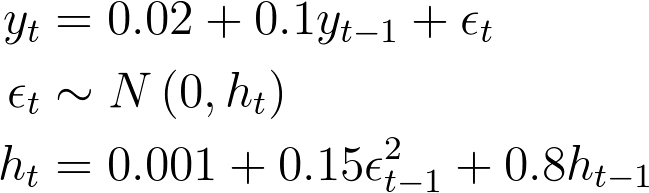
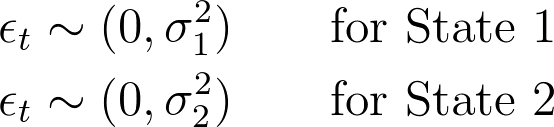
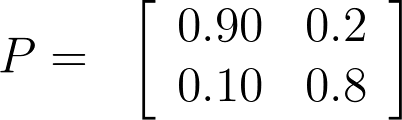

## Introduction {#introduction}

```{r, include=FALSE}
my.fig.height <- 3
my.fig.width <- 4
my.out.width <- '100%'
book.site.zip <- 'https://www.msperlin.com/blog/static/afedr-files/afedr_files.zip'
my.engine <- 'epub3'

format.cash <- function(x) {
  require(scales)

  x.formatted <- dollar(x,
                        prefix = '$',
                        decimal.mark = '.',
                        big.mark = ',',
                        largest_with_cents = Inf)

  return(x.formatted)
}

```

 In this chapter, we will deal with these types of models and their applications:

- Linear models (OLS)
- Generalized linear models (GLS)
- Panel data models
- Arima models (Integrated Autoregressive Moving Averages) 
- Garch models (Generalized Autoregressive Conditional Heteroskedasticity).
- Markov Regime switching models


## Linear Models (OLS) {#linear-models}

A linear  model is, without a doubt, one of the most used econometric models in R and finance.

A linear model with _N_ explanatory variables can be represented:

```{r echo=FALSE, purl=FALSE,include=!identical(my.engine , 'epub3'),results='asis'}
cat('$$y _t = \\alpha + \\beta _1 x_{1,t} + \\beta _2 x_{2,t} + ... + \\beta _N x_{N,t} + \\epsilon _t$$')
```

### Simulating a Linear Model

Consider the following equation:

```{r echo=FALSE, purl=FALSE,include=!identical(my.engine , 'epub3'),results='asis'}
cat('$$y _t = 0.5 + 2 x_{t} + \\epsilon _t$$')
```

We can use R to simulate _1.000_ observations for `r if (my.engine!='epub3') {'$y_t$'} else {'_y_'}`. We first define `r if (my.engine!='epub3') {'$x_t$'} else {'_x_'}` and the model's error, `r if (my.engine!='epub3') {'$\\epsilon _t$'} else {'_epsilon_'}`, as random variables from the Normal distribution with zero mean and variance equal to one. 

```{r}
set.seed(50)

# number of obs
n_T <- 1000 

# set x as Normal (0, 1)
x <- rnorm(n_T)

# set coefficients
my_alpha <- 0.5
my_beta <- 2

# build y
y <- my_alpha + my_beta*x + rnorm(n_T)
```

Using `ggplot,` we can create a scatter plot to visualize the correlation between objects `x` and `y.`

```{r, eval=TRUE, tidy=FALSE, fig.height=my.fig.height, fig.width=my.fig.width}
library(tidyverse)

# set temp df
temp_df <- tibble(x = x, 
                  y = y)

# plot it
p <- ggplot(temp_df, aes(x = x, y = y)) + 
  geom_point(size=0.5) + 
  labs(title = 'Example of Correlated Data') + 
  theme_bw()

print(p)
```

Clearly, there is a positive linear correlation. 


### Estimating a Linear Model {#estimating-ols} 

In R, the main function for estimating a linear model is `lm.` Let's use it to estimate a model from the previous simulated data. \index{base!lm}

```{r}
# set df
lm_df <- tibble(x, y)

# estimate linear model
my_lm <- lm(data = lm_df, formula = y ~ x)
print(my_lm)
```

Moreover, when it comes to the output of `lm,` then it is important that you understand that it is an object similar to a `list.` Therefore, its elements can be accessed using the `$` operator. Let's print all available names:

```{r}
# print names in model
print(names(my_lm))
```

As you can see, there is a slot called `coefficients.` Let's check its contents. 

```{r}
print(my_lm$coefficients)
```

Additional information is available in the resulting object from `summary`. Let's look at the names of the output:

```{r}
my_summary <- summary(my_lm)
print(names(my_summary))
```

Now, let's move to an example with real data. For that, we will estimate the beta coefficient of a randomly selected stock. The beta specification, also called market model, is given by:

```{r echo=FALSE, purl=FALSE,include=!identical(my.engine , 'epub3'),results='asis'}
cat('$$ R _t = \\alpha + \\beta R_{M,t} + \\epsilon _t$$')
```

First, let's load the SP500 dataset. \index{calculating beta}

```{r}
library(tidyverse)

# load stock data
my_f <- afedR::afedR_get_data_file('SP500-Stocks-WithRet.rds')
my_df <- read_rds(my_f)

# select rnd asset and filter data 
set.seed(10)

my_asset <- sample(my_df$ticker,1)
my_df_asset <- my_df[my_df$ticker == my_asset, ]

# load SP500 data
df_sp500 <- read.csv(file = afedR::afedR_get_data_file('SP500.csv'), 
                     colClasses = c('Date','numeric'))

# calculate return
calc_ret <- function(P) {
  N <- length(P)
  ret <- c(NA, P[2:N]/P[1:(N-1)] -1)
}

df_sp500$ret <- calc_ret(df_sp500$price)

# find location of dates in df_sp500
idx <- match(my_df_asset$ref.date, df_sp500$ref.date)

# create column in my_df with sp500 returns
my_df_asset$ret_sp500 <- df_sp500$ret[idx]

# print number of rows in datasets
print(nrow(my_df_asset))
print(nrow(df_sp500))
```

Now, let's estimate the linear model.

```{r}
# estimate beta model
my_beta_model <- lm(data = my_df_asset, 
                    formula = ret ~ ret_sp500)

# print it
print(summary(my_beta_model))
```

```{r, purl=FALSE, echo=FALSE}
beta <- format(coef(my_beta_model)[2],
               digits=3)
```

The output shows that stock `r my_asset` has a beta equal to `r beta`. This means this is an aggressive stock with high sensitivity to market movements. 


## Generalized Linear Models (GLM)

The generalized linear model (GLM) is a flexible alternative to a linear model. It allows the user to change the distribution of the error and the link function, a systematic way that quantifies how the explained variable will be affected by the response variable. 

We can write a general univariate GLM specification as:

```{r echo=FALSE, purl=FALSE,include=!identical(my.engine , 'epub3'),results='asis'}
cat('$$ E \\left( y _t \\right) = g \\left(\\alpha + \\sum ^N _{i=1} \\beta _i x_{i,t}  \\right)$$')
```

### Simulating a GLM Model

As an example, let's simulate the following GLM model, where the response vector `r if (my.engine!='epub3') {'$y_t$'} else {' '}` is a Bernoulli variable that takes value 1 with probability `r if (my.engine!='epub3') {'$p_t$'} else {'_p_'}`. The probabilities are calculated from the non linear transformation of  `r if (my.engine!='epub3') {'$x_t$'} else {'_xt_'}`:


```{r echo=FALSE, purl=FALSE,include=!identical(my.engine , 'epub3'),results='asis'}
cat('$$ p _t  = \\frac{\\exp(2+5x_t)}{1+\\exp(2+5x_t)}  $$')
```

In R, we use the following code to build the response vector.

```{r}
set.seed(15)

# set number of obs
n_T <- 500

# set x
x = rnorm(n_T)

my_alpha <- 2
my_beta <- 5

# set probabilities
z = my_alpha + my_beta*x
p = exp(z)/(1+exp(z))

# set response variable
y = rbinom(n = n_T,
           size = 1, 
           prob = p)
```

Function `rbinom` creates a vector of 1s and 0s, based on the probabilities of input `prob`. Let's look at its content.

```{r, eval=TRUE, tidy=FALSE, fig.height=my.fig.height, fig.width=my.fig.width}
summary(y)
```

Object `y` contains zeros and ones, as expected. 


### Estimating a GLM Model

Let's use the previously simulated data to estimate a _logit_ model:

```{r}
# estimate GLM
df <- tibble(x, y)
my_family <- binomial(link = "logit")
my_glm <- glm(data = df, 
              formula = y ~ x , 
              family = my_family)

# print it with summary
print(summary(my_glm))
```

As an example, with real data, we'll use a credit card dataset from [Kaggle](https://www.kaggle.com/uciml/default-of-credit-card-clients-dataset)^[https://www.kaggle.com/uciml/default-of-credit-card-clients-dataset] to model credit risk. 

```{r}
library(tidyverse)

# read default data
my_f <- afedR::afedR_get_data_file('UCI_Credit_Card.csv')
df_default <- read_csv(my_f, 
                       col_types = cols())

glimpse(df_default)
```

For that, we'll also need to decode the values in some columns. We can find such information from the [website](https://www.kaggle.com/uciml/default-of-credit-card-clients-dataset).

```{r}
library(tidyverse)

# read credit card data 
# source: 
# www.kaggle.com/uciml/default-of-credit-card-clients-dataset
# COLUMNS: GENDER: (1 = male; 2 = female). 
#          EDUCATION: 1 = graduate school; 
#                     2 = university; 
#                     3 = high school; 
#                     4 = others. 
#          MARRIAGE: 1 = married; 
#                    2 = single; 
#                    3 = others 
df_default <- df_default %>% 
  mutate(default = (default.payment.next.month == 1), 
         D_male_gender = (SEX == 1),
         age = AGE,
         educ = dplyr::recode(as.character(EDUCATION),
                              '1' = 'Grad',
                              '2' = 'University', 
                              '3' = 'High School', 
                              '4' = 'Others',
                              '5' = 'Unknown',
                              '6' = 'Unknown'),
         D_marriage = (MARRIAGE == 1)) %>%
  select(default, D_male_gender, age, educ, D_marriage) 

glimpse(df_default)

```

Now we only have the columns of interest, with more appealing names and content. Let's proceed to the estimation of the glm model.

```{r}
# estimate glm model
glm_credit <- glm(data=df_default, 
                   formula = default ~ D_male_gender +  age + 
                                       educ + D_marriage,
                   family = binomial(link = "logit"))

# show output
summary(glm_credit)
```


## Panel Data Models 

Panel data models are advised when the modeled data is multidimensional, covering information about individuals or companies that spawn over time. 

We can represent the simplest case of a panel data model as:

```{r echo=FALSE, purl=FALSE,include=!identical(my.engine , 'epub3'),results='asis'}
cat('$$ y_{i,t} = \\alpha _i + \\beta x_{i,t}+\\epsilon _{i,t} $$')
```


### Simulating Panel Data Models

Let's simulate a balanced panel data with fixed effects for twelve different firms and five time periods. 

```{r}
set.seed(25)

# number of obs for each case
n_T <- 5

# set number of groups
N <- 12

# set possible cases
possible_cases <- LETTERS[1:N]

# set parameters
my_alphas <- seq(-10, 10,
                 length.out = N)
my_beta <- 1.5

# set indep var (x) and dates
indep_var <- sapply(rep(n_T,N), rnorm)
my_dates <- Sys.Date() + 1:n_T

# create response matrix (y)
response_matrix <- matrix(rep(my_alphas, 
                              n_T), 
                          nrow = n_T, 
                          byrow = TRUE) + 
  indep_var*my_beta + sapply(rep(n_T,N),rnorm, sd = 0.25) 

# set df
sim_df <- tibble(firm = as.character(sapply(possible_cases, 
                                            rep, 
                                            times=n_T )),
                 dates = rep(my_dates, times=N),
                 y = as.numeric(response_matrix),
                 x = as.numeric(indep_var), 
                 stringsAsFactors = FALSE)

# print result
glimpse(sim_df)
```

The result is a `dataframe` object with `r nrow(sim_df)` rows and `r ncol(sim_df)` columns. We can look at the scatter plot of `x` and `y` for each firm using `ggplot2`:

```{r, eval=TRUE, tidy=FALSE, fig.height=my.fig.height, fig.width=my.fig.width}
library(ggplot2)

p <- ggplot(sim_df, aes(x = x, 
                        y = y)) + 
  geom_point() + geom_line() + 
  facet_wrap(~ firm) + 
  labs(title = 'Simulated Panel Data') + 
  theme_bw()

print(p)
```


### Estimating Panel Data Models

With the artificial data simulated in the previous step, let's estimate the model using package `plm` [@plm]. 

```{r, message=FALSE}
library(plm)

# estimate panel data model with fixed effects
my_pdm <- plm(data = sim_df, 
              formula = y ~ x, 
              model = 'within',
              index = c('firm','dates'))

# print coeficient
print(coef(my_pdm))
```


## Arima Models

Arima is a special type of model that uses the past of a time series to explain its future.

A simple example of an Arima model is defined by the following equation:

```{r echo=FALSE, purl=FALSE,include=!identical(my.engine , 'epub3'),results='asis'}
cat('$$y _t = 0.5 y_{t-1} - 0.2 \\epsilon _{t-1} + \\epsilon _t$$')
```

In this example, we have an ARIMA(AR = 1, D = 0, MA = 1) model without the intercept. 


### Simulating Arima Models

First, let's simulate an Arima model using function `arima.sim` from `stat.` This package is loaded by default, and we need not source it with the `library`. \index{stat!arima.sim}

```{r, tidy=FALSE}
set.seed(1)

# set number of observations
my_T <- 5000

# set model's parameters
my_model <- list(ar = 0.5, 
                 ma = -0.1)
my_sd <- 1

# simulate model
my_ts <- arima.sim(n = my_T, 
                   model = my_model , 
                   sd = my_sd)
```

We can look at the result of the simulation by creating a plot with the artificial time series:

```{r, tidy=FALSE}
library(ggplot2)

# set df
temp_df <- data.frame(y = unclass(my_ts), 
                      date = Sys.Date() + 1:my_T)

p <- ggplot(temp_df, aes(x = date, y = y)) + 
  geom_line(size=0.25) + 
  labs(title = 'Simulated ARIMA Model') + 
  theme_bw()

print(p)
```

The graph shows a time series with an average close to zero and strong instability. These are typical properties of an Arima model.


### Estimating Arima Models {#arima-estimating}

To estimate an Arima model, we use function `arima` from the same package. Let's estimate a model for our simulated data. \index{stat!arima}

```{r}
# estimate arima model
my_arima <- arima(my_ts, order = c(1,0,1))

# print result
print(coef(my_arima))
```


### Forecasting Arima Models

We can obtain the forecasts of an Arima model with the `forecast` function is also from package `forecast`.

```{r}
library(forecast)
# forecast model
print(forecast(my_arima, h = 5))
```


## GARCH Models

GARCH (Generalized Autoregressive Conditional Heterocesdasticity) models relate to the seminal work of @engle1982autoregressive and  @bollerslev1986generalized. 

A GARCH model is modular. See the following example for an ARIMA(1,0,0)-GARCH(1,1) model:

```{r echo=FALSE, purl=FALSE,include=!identical(my.engine , 'epub3'),results='asis'}
cat(paste0('$$\\begin{aligned} ',
           'y _t &=  \\mu + \\theta y_{t-1} + \\epsilon _t \\\\',
           '\\epsilon _t &\\sim N \\left(0, h _t \\right ) \\\\',
           'h _t &= \\omega + \\alpha \\epsilon ^2 _{t-1}+ \\beta h_{t-1} ',
           '\\end{aligned} $$'))
```


### Simulating Garch Models

In `fGarch,` we simulate a model using function `garchSim`. The first step is to load the package `fGarch` and create the model specification: \index{fGarch!garchSim}

```{r, tidy=FALSE, message=FALSE}
library(fGarch)

# set list with model spec
my_model = list(omega=0.001, 
                alpha=0.15, 
                beta=0.8, 
                mu=0.02, 
                ar = 0.1)

# set garch spec				
spec = garchSpec(model = my_model)

# print it
print(spec)
```

The previous code defines a Garch model equivalent to these equations.

```{r fig.align='center', echo=FALSE, out.width='40%', purl=FALSE, , include=identical(my.engine , 'epub3')}

```

```{r echo=FALSE, purl=FALSE,include=!identical(my.engine , 'epub3'),results='asis'}
cat(paste0('$$\\begin{aligned} ',
           'y _t &=  0.02 + 0.1 y_{t-1} + \\epsilon _t \\\\',
           '\\epsilon _t &\\sim N \\left(0, h _t \\right ) \\\\',
           'h _t &= 0.001 + 0.15 \\epsilon ^2 _{t-1}+ 0.8 h_{t-1} ',
           '\\end{aligned} $$'))
```

To simulate _1000_ observations of this model, we use function `garchSim`:

```{r}
set.seed(20)
# simulate garch model
sim_garch = garchSim(spec, n = 1000)
```

We can visualize the artificial time series generated by creating a plot with `ggplot`:

```{r, eval=TRUE, tidy=FALSE, fig.height=my.fig.height, fig.width=my.fig.width}
# set df for ggplot
temp_df <- tibble(sim.ret = sim_garch$garch, 
                  idx=seq_along(sim_garch$garch))

p <- ggplot(temp_df, aes(x = idx, 
                         y = sim.ret)) + 
  geom_line() + 
  labs(title = 'Simulated time series of garch model',
       y = 'Value of Time Series',
       x = '') + 
  theme_bw()

print(p)
```


### Estimating Garch Models {#estimating-garch}

In the following example, we estimate a Garch model for the artificial data created in the previous section. 

```{r, tidy=FALSE}
# estimate garch model
my_form <- formula('sim.ret ~ arma(1,0) + garch(1,1)')

my_garchfit <- garchFit(
  data = sim_garch, 
  formula = my_form,
  trace = FALSE)
```

To learn more about the estimated model, we can present it on the screen with the command `print`:

```{r}
print(my_garchfit) 
```


### Forecasting Garch Models

Forecasting Garch models involves two elements: a forecast for the conditional mean (see the first equation in the Garch formula) and a forecast for future values of conditional volatility (see the second equation). 

```{r}
# static forecast for garch
my_garch_forecast <- predict(my_garchfit, n.ahead = 3)

# print df
print(my_garch_forecast)
```


## Regime Switching Models 

Markov regime-switching models are a specification in which the selling point is the flexibility in handling processes driven by heterogeneous states of the world [@hamilton1994time]. 

If we want to motivate the model, we need to consider the following econometric process:

```{r echo=FALSE, purl=FALSE,include=!identical(my.engine , 'epub3'),results='asis'}
cat('$$ y_t=\\mu_{S_t} + \\epsilon_t $$')
```

where `r if (my.engine!='epub3') {'$S_t=1..k$'} else {'_St=1..k_'}` and `r if (my.engine!='epub3') {'$\\epsilon_t$'} else {'the residual '}`  follows a Normal distribution with zero mean and variance given by `r if (my.engine!='epub3') {'$\\sigma^2_{S_t}$'} else {' different regimes as well'}`. 

Now, let's assume the previous model has two states (_k=2_). An alternative representation is:

```{r echo=FALSE, purl=FALSE,include=!identical(my.engine , 'epub3'),results='asis'}
cat('\\begin{eqnarray*}
y_t=\\mu_{1} + \\epsilon_t \\qquad \\mbox{for State 1} \\\\
y_t=\\mu_{2} + \\epsilon_t \\qquad \\mbox{for State 2} 
\\end{eqnarray*}')
```

where:

```{r fig.align='center', echo=FALSE, out.width='30%', purl=FALSE,include=identical(my.engine , 'epub3')}

```

```{r echo=FALSE, purl=FALSE,include=!identical(my.engine , 'epub3'),results='asis'}
cat('\\begin{eqnarray*}
\\epsilon_t \\sim (0,\\sigma^2_{1}) \\qquad \\mbox{for State 1} \\\\
\\epsilon_t \\sim (0,\\sigma^2_{2}) \\qquad \\mbox{for State 2} 
\\end{eqnarray*}')
```


### Simulating Regime Switching Models

In R, two packages are available for handling univariate Markov regime-switching models, `MSwM` [@mswm] and `fMarkovSwitching` [@fmarkovswitching]. The last one also includes functions for simulating a time series. Before using it, let's install `fMarkovSwitching` from the R-Forge repository. Be aware this package is not available in CRAN.

```{r, eval=FALSE}
install.packages("fMarkovSwitching", 
                 repos="http://R-Forge.R-project.org")
```

```{r, include = FALSE}

if (!require('fMarkovSwitching')){
  install.packages("fMarkovSwitching", 
                   repos="http://R-Forge.R-project.org")
}

```

Once it is installed, let's look at its functions:

```{r}
library(fMarkovSwitching)

print(ls('package:fMarkovSwitching'))
```

The package includes functions for simulating, estimating, and forecasting an univariate markov switching model. Now, to conduct another example, we will simulate the regime switching model by using these equations:

```{r fig.align='center', echo=FALSE, out.width='30%', purl=FALSE,include=identical(my.engine , 'epub3')}
knitr::include_graphics("eqs/MS-SimModel.png")
```

```{r echo=FALSE, purl=FALSE,include=!identical(my.engine , 'epub3'),results='asis'}
cat('\\begin{align*}
y_{t}&= +0.5x_t+\\epsilon_{t} \\qquad \\mbox{State 1} \\\\
y_{t}&=-0.5x_t+\\epsilon_{t} \\qquad \\mbox{State 2} \\\\
\\epsilon _t &\\sim N(0,0.25) \\qquad \\mbox{State 1} \\\\
\\epsilon _t &\\sim N(0,1) \\qquad \\mbox{State 2}
\\end{align*}')
```

The transition matrix will be given by:

```{r fig.align='center', echo=FALSE, out.width='30%', purl=FALSE,include=identical(my.engine , 'epub3')}

```

```{r echo=FALSE, purl=FALSE,include=!identical(my.engine , 'epub3'),results='asis'}
cat('$$
P=\\left[ \\begin{array}{ccc}
0.90 & 0.2 \\\\
0.10 & 0.8
\\end{array} \\right ]
$$')
```

This model has two states with different volatilities. In each state, the impact of the explanatory variable will be different. From package `fMarkovSwitching,` we can use function `MS_Regress_Simul` to simulate this model. Look at the following code, where we simulate the model from the previous equations.

```{r}
set.seed(10)
library(fMarkovSwitching)

# number of obs
n_T <- 500 

# distribution of residuals
distrib <- "Normal"	

# number of states
k <- 2 	

# set transition matrix
P <- matrix(c(.9 ,.2,
              .1 ,.8), 
            nrow = 2, 
            byrow = T)

# set switching flag		   
S <- c(0,1)

# set parameters of model (see manual for details)
nS_param <- matrix(0)    
S_param <- matrix(0,sum(S),k)
S_param[,1] <-  .5         
S_param[,2] <- -.5

# set variance of model
sigma <- matrix(0, 1, k)
sigma[1,1] <- sqrt(0.25)  # state 1
sigma[1,2] <- 1           # state 2

# build list
Coeff <- list(P = P               ,
              S = S               ,
              nS_param = nS_param ,
              S_param = S_param   ,
              sigma = sigma       )

# simulate model
my_ms_simul <- MS_Regress_Simul(nr = n_T,
                                Coeff = Coeff, 
                                k = k, 
                                distrib = distrib)
```


Once the model is simulated and available, let's plot the time series of artificial values. 

```{r, fig.height=my.fig.height, fig.width=my.fig.width}
library(ggplot2)
df_to_plot <- tibble(y = my_ms_simul@dep, 
                         x = Sys.Date()+1:my_ms_simul@nr,
                         states = my_ms_simul@trueStates[, 1])

p <- ggplot(data = df_to_plot, 
            aes(y = y, x = seq_along(y))) + 
  geom_line() + 
  labs(title = 'Simulated markov switching process',
       x = '', 
       y = 'Value') + 
  theme_bw()

print(p)
```

We can also look at the simulated states:

```{r, eval=TRUE, tidy=FALSE, fig.height=my.fig.height, fig.width=my.fig.width}
library(ggplot2)
df_to_plot <- tibble(y = my_ms_simul@dep, 
                         x = Sys.Date()+1:my_ms_simul@nr,
                         states = my_ms_simul@trueStates[,1])

p <- ggplot(data = df_to_plot, 
            aes(y = states, x = x)) + 
  geom_line() + 
  labs(y = 'Probability of state 1') + 
  theme_bw()

print(p)
```

As expected, the model is switching from one state to the other. Either state is strongly predominant over time, but state one seems to have a longer duration than state two. This property is controlled by the transition probabilities set in the object `P.`


### Estimating Regime Switching Models

We can estimate a univariate Markov switching model with function `MS_Regress_Fit.` Let's try it for the previously simulated time series. 

```{r, message=FALSE, results='hide', cache=TRUE}
# set dep and indep 
dep <- my_ms_simul@dep
indep <- my_ms_simul@indep

# set switching parameters and distribution
S <- c(0,1)	
k <- 2		
distIn <- "Normal" 

# estimate the model
my_ms_model <- MS_Regress_Fit(dep, indep, S, k)
```

After finishing the estimation, let's look at the output.

```{r}
# print estimation output
print(my_ms_model)
```

The estimated coefficients are close to the ones from the simulation. The estimation recognized the parameters from the simulated data. The output object from `MS_Regress_Fit` can also be used with a `plot` for a  custom figure. Have a look.

```{r, eval=TRUE, tidy=FALSE, fig.height=6, fig.width=7}
plot(my_ms_model)	# plotting output
```

As an example with real data, let's estimate the same Markov regime-switching model for the SP500 returns over a long time period. 

```{r, message=FALSE,results='hide', cache=TRUE}
library(BatchGetSymbols)

df_SP500 <- BatchGetSymbols(tickers = '^GSPC', 
                            first.date = '2010-01-01', 
                            last.date = '2019-01-01')$df.tickers


# set input objects to MS_Regress_Fit
ret <- na.omit(df_SP500$ret.closing.prices)
dep <- matrix(ret, nrow = length(ret))
indep <- matrix(rep(1, length(dep)),nrow = length(dep))

S <- c(1)	# where to switch (in this case in the only indep)
k <- 2		# number of states
distIn <- "Normal" #distribution assumption

# estimating the model
my_SP500_MS_model <- MS_Regress_Fit(dep, indep, S, k)	
```

And now, we check the result.

```{r}
# printing output
print(my_SP500_MS_model)	
```


```{r, echo=FALSE, purl=FALSE}
n.digits <- 3

volat1 <- format(my_SP500_MS_model@Coeff$sigma[1]*100, digits = n.digits)
volat2 <- format(my_SP500_MS_model@Coeff$sigma[2]*100, digits = n.digits)

u1 <- format(my_SP500_MS_model@Coeff$indep_S[1]*100,digits = n.digits)
u2 <- format(my_SP500_MS_model@Coeff$indep_S[2]*100,digits = n.digits)
```


### Forecasting Regime Switching Models

Package `MS_Regress` provides function `MS_Regress_For` for statically forecasting a univariate Markov switching model. 

```{r}
# make static forecast of regime switching model
newIndep <- 1

my_for <- MS_Regress_For(my_SP500_MS_model , newIndep)

# print output
print(my_for)
```

```{r, echo=FALSE, purl=FALSE}
next_day <- max(df_SP500$ref.date)+1

ret_nextday <- format(my_for$condMean*100, digits = 2)
volat_nextday <- format(my_for$condStd*100, digits = 2)

```


## Dealing with Several Models

In the practice of research, we will likely estimate more than one model. We might want to test different models, have different study cases, or run a robustness test by estimating the same model in different time periods. 

Let's start with an example. Here, we will estimate an Arima model for the returns of four random stocks. 

```{r}
set.seed(10)

# set number of stocks
n_stocks <- 4

# load data from .rds
my_f <- afedR::afedR_get_data_file('SP500-Stocks-WithRet.rds')
df_stocks <- read_rds(my_f) 
  
# select tickers
my_tickers <- sample(unique(df_stocks$ticker), n_stocks)

# set my_df
df_temp <- df_stocks %>% 
  dplyr::filter(ticker %in% my_tickers)

# renew factors in ticker
df_temp$ticker <- as.factor(as.character(df_temp$ticker))
```

Now, what we want to do with this data is separate the returns by ticker and use function `arima` to estimate a model for each stock. One solution is to use function `tapply`: \index{base!tapply}

```{r, tidy=FALSE}
my_l <- tapply(X = df_temp$ret, 
               INDEX = df_temp$ticker, 
               FUN = arima, 
               order = c(1, 0, 0))
```

Each model is available in `my_l`. To retrieve all coefficients, we can use `sapply` and function `coef`: \index{base!sapply} \index{base!coef}

```{r}
# print all coefficients
print(sapply(X = my_l, 
             FUN = coef))
```

For an example, we are going to estimate several models with the `by` function, so let's calculate the beta coefficient for all stocks in our database. First, let's load the index data and add a new column in `df_stocks` with the returns of the SP500 index.

```{r}
# load SP500 data
df_sp500 <- read.csv(file = afedR::afedR_get_data_file('SP500.csv'), 
                     colClasses = c('Date','numeric'))

# calculate return
calc_ret <- function(P) {
  N <- length(P)
  ret <- c(NA, P[2:N]/P[1:(N-1)] -1)
}

df_sp500$ret <- calc_ret(df_sp500$price.close)


# find location of dates in df_sp500
idx <- match(df_stocks$ref.date, 
             df_sp500$ref.date)

# create column in my_df with sp500 returns
df_stocks$ret.sp500 <- df_sp500$ret[idx]
```

The next step is to create a function that will take a `dataframe` as input, use the returns of the asset and the returns of the SP500 index to output the beta. Have a look:

```{r}
estimate_beta <- function(df) {
  # Function to estimate beta from dataframe of stocks returns
  #
  # Args:
  #   df - Dataframe with columns ret and ret.sp500
  #
  # Returns:
  #   The value of beta
  
  my_model <- lm(data = df, 
                 formula = ret ~ ret.sp500)
  
  return(coef(my_model)[2])
}
```

Now, we can use the previous function with `by.`

```{r}
# calculate beta for each stock
my_betas <- by(data = df_stocks, 
               INDICES = df_stocks$ticker, 
               FUN = estimate_beta)

glimpse(as.numeric(my_betas))
```

The values of the different `betas` are available in object `my_betas`. Let's look at the distribution of our betas using a histogram:

```{r, eval=TRUE, tidy=FALSE, fig.height=my.fig.height, fig.width=my.fig.width}
library(ggplot2)

df_to_plot <- tibble(betas = as.numeric(my_betas)) 

p <- ggplot(df_to_plot, aes(x = my_betas)) +
  geom_histogram(bins = 40) + 
  labs(x = 'Betas',
       y = 'Frequency',
       title = 'Histogram of Betas for SP500 stocks',
       subtitle = paste0('Market models estimated with data from ',
                         min(df_stocks$ref.date), ' to ', 
                         max(df_stocks$ref.date), '\n',
                         length(unique(df_stocks$ticker)), 
                         ' stocks included'),
       caption = 'Data from Yahoo Finance') + 
  theme_bw()
  

print(p)
```

For the SP500 data, we find no negative value of beta. Not surprisingly, the average beta is very close to one.

Another way of storing and managing several models is to use the capabilities of list-columns with `dplyr`. 

```{r, tidy=FALSE}
library(dplyr)

my_tab <- df_stocks %>%
  group_by(ticker) %>%
  do(my_model = arima(x = .$ret, order = c(1,0,0)))

glimpse(my_tab)
```

We have a list-column, called `my_model`, storing the objects with each result from the estimation. We can also use `mutate` to get information about the model. Look at the next code, where we present the coefficients of the model in the same object. 

```{r , tidy=FALSE}
my_model_tab <- df_stocks %>%
  group_by(ticker) %>%
  do(my_model = arima(x = .$ret, order = c(1,0,0))) %>%
  mutate(alpha = coef(my_model)[2],
         ar1 = coef(my_model)[1])

glimpse(my_model_tab)
```

Another trick in handling models with `dplyr` is to use package `broom` [@broom] to access the estimated coefficients. 

```{r, message=FALSE, tidy=FALSE}
library(broom)

# get coefs with tidy
my_coef_tab <- my_model_tab %>% 
  tidy(my_model)

# print result
print(head(my_coef_tab))
```

Notice how function `tidy` included the estimated errors from the model. 

```{r}
# get info on models
my_info_models <- my_model_tab %>% 
  glance(my_model)

print(head(my_info_models))
```


## Exercises

01. Simulate the following linear process in R:

```{r}
set.seed (5)

# number of obs
nT <- 100

# set x as Normal (0, 1)
x <- rnorm (nT)

# set coefficients
my_alpha <- 1.5
my_beta <- 0.5

# build y
y <- my_alpha + my_beta * x + rnorm (nT, sd = 5)
```

Using the simulated data, `x` and `y` estimate a linear model where `x` is the explanatory variable, and `y` is the explained variable. Use the `summary` function on the returned object from `lm` to find more details about the model. Is the beta coefficient significant at 5%?

02. Using package `car` and the data we previously simulated, test the joint hypothesis that the value of alpha equals to 1.5 and beta equals to 0.5. Is the null hypothesis of the test rejected at 5%?

03. Use package `gvlma` to test the OLS assumptions for the previously estimated model. Does the model pass all tests? If not, increase the value of `nT` to 5000 and try again. 

04. **CHALLENGE** - Using your programming skills, conduct a study to see how the value of `nT` impacts the test of the joint hypothesis from the previous exercise. Thus, that is to say, and we need to keep everything else constant and, for each test of `nT,` simulate 1,000 series and estimate the same model for each one. Check for each `nT` the null hypothesis of the test. A scatter-plot was showing the relationship between `nT,` and the p-values of the test would be interesting for the analysis.

05. From package `BatchGetSymbols,` use functions `GetSP500Stocks` and `BatchGetSymbols` to download the past three years price data for all stocks belonging to the current SP500 index. Calculate the systemic risk (beta) for each stock and display the histogram of the estimated _betas_. 

06. For the same stock data from the previous exercise, estimate a panel data version of the market model, that is, each stock has a different _alpha_, but the same _beta_. Is the estimated beta significant at 5%?

07. Using the tidyverse functions `dplyr::group_by` and `dplyr::do,` estimate an ARIMA(1, 0, 0) model for the returns of each stock using the same data as the previous exercise. On the same `tibble,` create a new column with the return forecast at _t+1_ for each ticker. Which stock has the highest expected return for the next day?

08. Using the same "pipeline" code as the previous question, use package `fGarch` to add a new list-column with the estimation of an ARMA(1,0)-GARCH(1,1) model for the returns of each stock. Add another column with the volatility forecast (standard deviation) and the return, both at _t + 1_. Increment the table by creating a trade index, the result of dividing the expected return (mean forecast) calculated in the previous item by the predicted risk (standard deviation forecast). Which stock is more attractive and has a higher value of this index? Tip: Ensure that you remove all of the `NA` values before estimating the ARMA-GARCH model. 

09. For the same SP500 database, set `set.seed(10)` and filter data for four randomly selected stocks. Again, make sure all `NA` values are removed from the `dataframe.` For each stock, estimate a simple Markov regime-switching model for its returns. Such a model will have two states for intercept and volatility. The structure of the model is equivalent to the first model in the section "Estimating Regime Switching Models" of chapter 11. Use the `plot` function to display the smoothed probability plot and use `png::jpeg` and `grDevices::dev.off` to save each figure in a folder named `'fig'`.
