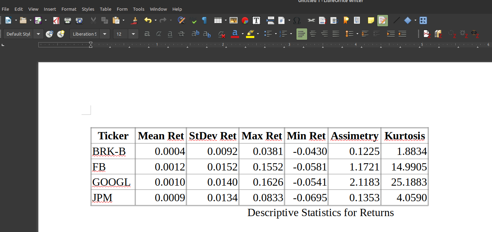
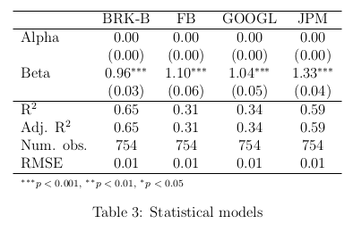
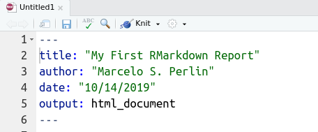
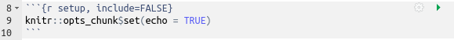
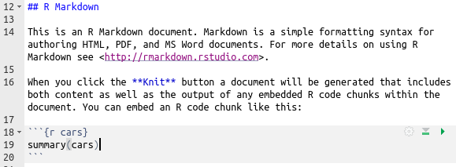
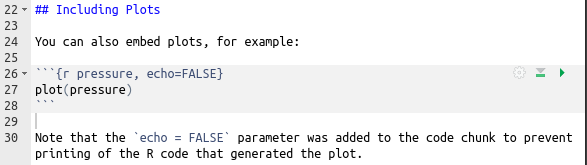
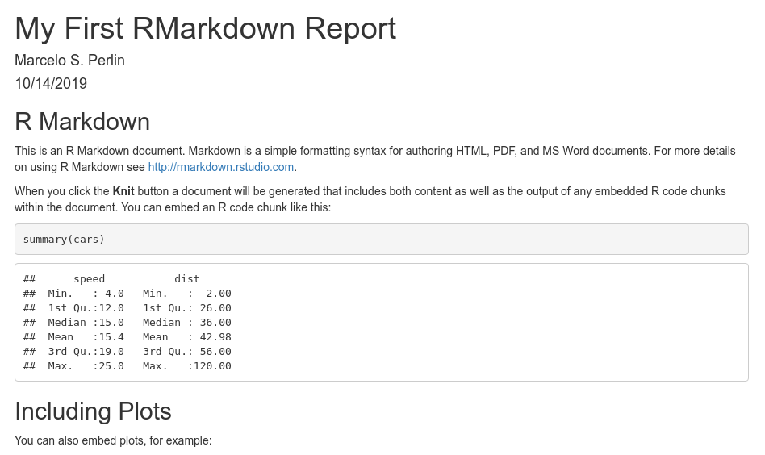

## Introduction {#introduction}

```{r, include=FALSE}
my.fig.height <- 3
my.fig.width <- 4
my.out.width <- '100%'
book.site.zip <- 'https://www.msperlin.com/blog/static/afedr-files/afedr_files.zip'
my.engine <- 'epub3'

format.cash <- function(x) {
  require(scales)

  x.formatted <- dollar(x,
                        prefix = '$',
                        decimal.mark = '.',
                        big.mark = ',',
                        largest_with_cents = Inf)

  return(x.formatted)
}

```

Now it is to time to study the best way to report our results, exporting tables and figures to a written document. 

Two strategies: 

- separate the table and figure creation stage from the writing stage;

- write articles with the dynamic reporting capability of **Rmarkdown**, which is where text and code are merged within the same file. 


## Reporting Tables

Simple tables, such as descriptive statistics of the data, must be created from a `dataframe`. 

```{r, tidy=FALSE}
library(tidyverse)
library(BatchGetSymbols)
library(DistributionUtils) 

# set number of rows in table
my_tickers <- c('FB', 'GOOGL',
                'JPM', 'BRK-B')

first_date = '2015-01-01'
last_date = '2018-01-01'

df_stocks <- BatchGetSymbols(tickers = my_tickers,
                             first.date = first_date,
                             last.date = last_date,
                             bench.ticker = '^BVSP')[[2]]

# create descriptive table
my_desc_table <- df_stocks %>%
  group_by(Ticker = ticker ) %>%
  summarise('Mean Ret' = mean(ret.adjusted.prices, na.rm = TRUE),
            'StDev Ret' = sd(ret.adjusted.prices, na.rm = TRUE),
            'Max Ret' = max(ret.adjusted.prices, na.rm = TRUE),
            'Min Ret' = min(ret.adjusted.prices, na.rm = TRUE),
            Assimetry = skewness(ret.adjusted.prices, na.rm = TRUE),
            Kurtosis = kurtosis(ret.adjusted.prices, na.rm = TRUE))

print(my_desc_table)
```

In creating the `dataframe`, notice how we define column names as text (quotation marks). This is necessary as we are using spaces in the names. Now that we have our table, let's export it to LaTeX.

```{r, message=FALSE}
library(xtable)

# set xtable object
my_xtable <- xtable(x = my_desc_table,
                    label = 'tab:DescRetStats',
                    caption = 'Descriptive Statistics for Returns',
                    digits = 4)

# check if folder exists
if (!dir.exists('tabs')) {
	dir.create('tabs')
}

# print output to latex file
my_tex_file <- 'tabs/MyTable.tex'

# save it
print(my_xtable,
      include.rownames = FALSE,
      file = my_tex_file,
      type='latex')
```

After compiling the LaTeX file, the result will be identical to \@ref(fig:table-xtable2), a printable table in an article or scientific report.

```{r table-xtable2,  out.width = '75%', fig.align='center', echo=FALSE, purl=FALSE, fig.cap= 'Example of LaTeX table with xtable' }
knitr::include_graphics('tabs/table-4-2.png')
```

As for exporting tables to _Word_ (_Microsoft_) or _Writer_ (_Libreoffice_) files, there is no direct way to do this using `xtable`.

```{r}
# set html file for output
my_html_file <- 'tabs/MyTable.html'

# write it!
print(x = my_xtable,
      file = my_html_file,
      type = 'html',
      include.rownames = FALSE )
```

The result should look similar to the table in Figure \@ref(fig:Writer-TableExample2).

```{r Writer-TableExample2,  out.width = '75%', fig.align='center', echo=FALSE, purl=FALSE, fig.cap= 'Example of table in Writer (LibreOffice)' }

```


## Reporting Models {#reporting-models}

Reporting the estimation of models requires a special type of table, with an unique structure in the presentation of different performance measures, comparison of coefficients for different models, besides the individual parameters and their statistics.

As an example, let's use the `texreg` package to report the results of the  _beta_ calculation of four different stocks. 

```{r, tidy=FALSE, message=FALSE}
library(texreg)
library(dplyr)
library(BatchGetSymbols)

# get Ibov data
my_tickers <- c('^GSPC')

first_date = '2015-01-01'
last_date = '2019-01-01'

df_sp500 <- BatchGetSymbols(tickers = my_tickers,
                             first.date = first_date,
                             last.date = last_date)[[2]]

# set sp500 ret column
idx <- match(df_stocks$ref.date, df_sp500$ref.date)
df_stocks$ret_mkt <- df_sp500$ret.adjusted.prices[idx]

# estimate betas
beta_tab <- df_stocks %>%
  group_by(ticker) %>%
  do(beta_model = lm(data=., ret.adjusted.prices ~ ret_mkt))

# report result
est_table <- screenreg(l = beta_tab$beta_model,
                       custom.model.names = beta_tab$ticker,
                       custom.coef.names = c('Alpha', 'Beta'),
                       digits = 2)

# print it
print(est_table)
```

The following chunk is an example of using `texreg` to export a LaTeX table:

```{r, tidy=FALSE, message=FALSE}
# report result
est_table <- texreg(l = beta_tab$beta_model,
                    file = 'tabs/Example_texreg.tex',
                    custom.model.names = beta_tab$ticker,
                    custom.coef.names = c('Alpha', 'Beta'),
                    digits = 2)
```

The result in a LaTex file compiled for pdf will equal figure \@ref(fig:table-texreg).

```{r table-texreg,  out.width = '75%', fig.align='center', echo=FALSE, purl=FALSE, fig.cap= 'Example of LaTeX table with texreg' }

```


## Creating Reports with _RMarkdown_

_RMarkdown_ innovates the process of writing reports by merging text with code. 

_Rmarkdown_'s text structure is based on [**markdown**](https://daringfireball.net/projects/markdown/)^[https://daringfireball.net/projects/markdown/], a language for writing and formatting text on the internet. 

Let's explore how `Rmarkdown` works with a practical example. Open RStudio and click _New Files_ and then _New R Markdown_. 

After pressing _OK_, a file will appear in the _scripts_ editing screen. Let's dissect its elements with screenshots. The first part is the file header, Figure \@ref(fig:rmarkdown-header).

```{r rmarkdown-header,  out.width = '65%', fig.align='center', echo=FALSE, purl=FALSE, fig.cap= 'Header Code in Rmarkdown' }

```

The document header is identified using the `---` separator. Each item is predefined and recognized by `RMarkdown`, including title (`title:`), author (`author:`), document date (`date:`) and output type (`output:` ). 

The next piece of text is identified in Figure \@ref(fig:rmarkdown-setup). This is the report setup code. 

```{r rmarkdown-setup,  out.width = '85%', fig.align='center', echo=FALSE, purl=FALSE, fig.cap= 'Rmarkdown code' }

```

Moving on, the `## R Markdown` text in Figure \@ref(fig:rmarkdown-text) defines a title, in this case at the second level of depth. 

```{r rmarkdown-text,  out.width = '75%', fig.align='center', echo=FALSE, purl=FALSE, fig.cap= 'Text in RMarkdown'}

```

The second part of \@ref(fig:rmarkdown-text) is the text itself. Here you can write freely, paying attention only to the formatting structure. 

The last part in \@ref(fig:rmarkdown-text) displays the `summary(cars)` code, that is, it summarizes an object. 

Figure \@ref(fig:rmarkdown-figures) shows the last section of the example. This creates and displays a figure in the final report. To do so, simply call the `plot` function or `ggplot2` functions normally.

```{r rmarkdown-figures,  out.width = '75%', fig.align='center', echo=FALSE, purl=FALSE, fig.cap= 'Figures in Rmarkdown' }

```

Now that we understand the components that make up our _Rmarkdown_ report, it's time to compile and analyze the final result. 

```{r rmarkdown-saidahtml,  out.width = '75%', fig.align='center', echo=FALSE, purl=FALSE, fig.cap= 'Example of compiled report in html' }

```


## Exercises

01. Consider the Grunfeld data available at link [https://eeecon.uibk.ac.at/~zeileis/grunfeld/Grunfeld.csv](https://eeecon.uibk.ac.at/~zeileis/grunfeld/Grunfeld.csv). Import the data in R and create a descriptive table of the variables. This table should provide enough information for the reader to understand the data. Use `xtable` package to report it in LaTeX or Word/Writer format.

02. Using `BatchGetSymbols::GetSP500Stocks` function, select four random stocks and download stock prices for the previous 3 years. Estimate an ARIMA (1,0,1) model for each stock and report the result on the R screen with `texreg::screenreg` function.

03. Create a new report in _Rmarkdown_ covering the two previous exercises. Compile the report in html and open it in your _browser_.

04. [**CHALLENGE**] - Download SP500 components data for the past three years. Estimate an ARMA(1, 1) - Garch(1, 1) model for the returns of each stock. Now, let's automate a reporting procedure. Write a function that takes as input a Garch model and output a text with the report of the results. Use this function in a rmarkdown document, providing a paragraph for each stock in the database. 
