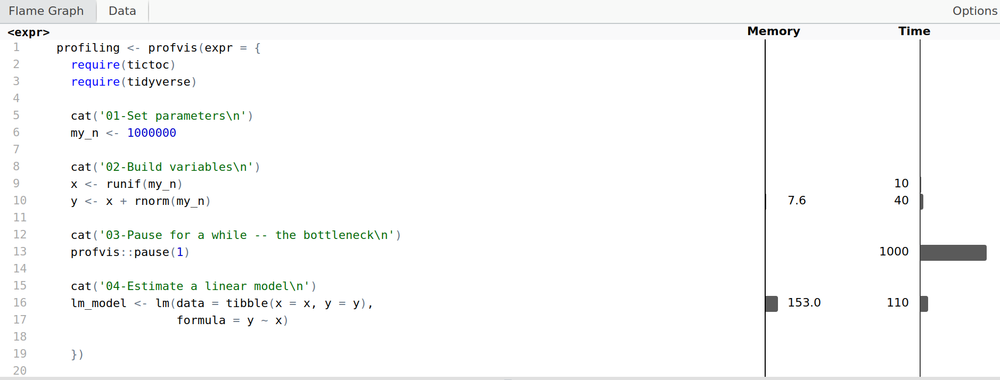

## Introduction {#introduction}

```{r, include=FALSE}
my.fig.height <- 3
my.fig.width <- 4
my.out.width <- '100%'
book.site.zip <- 'https://www.msperlin.com/blog/static/afedr-files/afedr_files.zip'
my.engine <- 'epub3'

format.cash <- function(x) {
  require(scales)

  x.formatted <- dollar(x,
                        prefix = '$',
                        decimal.mark = '.',
                        big.mark = ',',
                        largest_with_cents = Inf)

  return(x.formatted)
}

```

In this chapter, we will study how to be more efficient in writing R scripts. 

Here, efficiency means to achieve the same results with our R code, but spending far less time working on it. 

## Optimizing your Programming Time

Just like we can improve the content in an essay, we can also optimize the way we write code

DRY (don't repeat yourself)
: Whenever you find yourself writing similar code lines, or copying and pasting in different parts of the code, consider writing a function. 

KISS (keep it simple and _stunning_)
: The simplest and most-straightforward your code, the better. 

Folder structure
: Organize all elements of the scripts in relative folders. 

Comments are your timeless friend
: Even when writing just to yourself, keep comments alive and instructive. 

Keep a clear notation
: Code notation is the personal touch you bring to your work. It sets how you name variables and functions and how you write code in general. 

**Filenames and paths:** Names and paths of files should help identify their content. 

```{r}
# GOOD
my_f <- '01_Run_Research.R'
my_f <- '02_Import_and_Clean_Data.R'
my_f <- 'data/gdp.rds'
my_f <- 'fcts/report_functions.R'

# BAD
my_f <- 'functions.R'
my_f <- 'R/script.R'
my_f <- 'New folder/script_ver_03.R'
my_f <- 'New folder/script_ver_05_with_clean_data.R'

```

**Sections of code**: Use dashes within the script to break sections of the code. Remember that RStudio will create shortcuts for each stage in a small window just above the prompt and below the editor.

```{r}
# Import data ----


# Clean data ----


# Estimate models ----
```

**Variable and function names**: Use these guidelines for naming objects, including functions:

- Give preference to lowercase characters when naming objects;
- Keep names short, concise and intuitive (easier said than done, but try your best..);
- Use the first few words to identify the class of an object (e.g. dataframe `df_gdp`, list `l_args`);
- Avoid the use of dots (`.`) when connecting words in the object's names. The dot has a special use when [calling S3 objects](http://adv-r.had.co.nz/S3.html)^[http://adv-r.had.co.nz/S3.html], an object-oriented approach in R, not discussed in this book. In substitution, use underscore (`_`) to link words in a name. 

```{r, eval=FALSE}
# GOOD
my_seq <- 1:100 # simple and clean
df_prices <- tibble()  # for sure it is a dataframe with prices!
fct_plot_prices <- function() # I know what it does before executing it!
  l_args <- list() # also nice and clean

# BAD
DF <- tibble() # all uppercase and generic
DataFrame <- tibble() # camel case and same name as object
list <- list() # Same name as constructor. Does it even work? 
# It does..
Prices_of_Facebook <- tibble() # very informative,
# but too long!
DATAFRAME_WITH_SPECIAL_DATA <- tibble() # too long! 
# Why SHOUT in code?
# be nice
df.prices <- tibble() # use of dots
```

**Other code conventions**:

- Always put a space around operators (`=`, `>`, `<`, ...) and use parenthesis to indicate logical tests:

```{r}
# GOOD
x <- 10
flag <- (x > 0)

# BAD
x<-0
flag<-x>0
```

- Always set a space after using comma, just like you would when writing:

```{r, eval = FALSE}
# GOOD
my_fct(1, 2, 3)
my_x <- c(1, 2, 3)

# BAD
my_fct(1,2,3)
my_x <- c(1,2,3)
```

These are simple and important rules you can follow for keeping your code more readable. Additionally, you can find a more complete description in the [tidyverse style guide](https://style.tidyverse.org/)^[https://style.tidyverse.org/]. 


## Optimizing Code Speed

Optimizing speed in R scripts is a two-stage process: we first need to identify the parts of the code that are taking more time -- the so-called profiling stage -- and then try to fix it.


### Profiling Code

A simple and easy way of doing this is providing messages of the stages of the script in the prompt. When you watch the code run live, it will be easy to notice which parts are taking more time to run and where we should try to optimize. 

As an example, I'll first write a function that will simulate some data, pause for one second and then estimate a linear model. The pause is the bottleneck, the part that will take most of the execution time. \index{Profiling code}

```{r}
my_bench_fct <- function() {
  
  require(tictoc)
  require(tidyverse)
  
  cat('01-Set parameters\n')
  my_n <- 1000000
  
  cat('02-Build variables\n')
  x <- runif(my_n)
  y <- x + rnorm(my_n)
  
  cat('03-Pause for a while -- the bottleneck\n')
  profvis::pause(1)
  
  cat('04-Estimate a linear model\n')
  lm_model <- lm(data = tibble(x = x, y = y), 
                 formula = y ~ x)
  
  return(lm_model)
}

out <- my_bench_fct()
```

Whenever you make a call to function `my_bench_fct` you'll see the messages scrolling down in R's prompt. 

For complex and extensive code, however, using `cat` to print messages may not help much, especially when each stage of the script has many lines of code. 

Function `base::Rprof` works by first calling it with the location of a file to save the results. Any code executed after the call to `Rprof`, will be evaluated for its execution time. When finished, we pause profiling by calling `Rprof(NULL)`. See an example next:

```{r, results='hold'}
# set temporary file for results
profiling_file <-  tempfile(pattern = 'profiling_example', 
                            fileext = '.out')

# initialize profiling
Rprof(filename = profiling_file)

cat('01-Set parameters\n')
my_n <- 1000000

cat('02-Build variables\n')
x <- runif(my_n)
y <- x + rnorm(my_n)

cat('03-Pause for a while -- the bottleneck\n')
profvis::pause(1)

cat('04-Estimate a linear model\n')
lm_model <- lm(data = tibble(x = x, y = y), 
               formula = y ~ x)

# stop profiling
Rprof(NULL)
```

The actual results can be imported with `base::summaryRprof`:

```{r}
# check results
df_res <- summaryRprof(profiling_file)$by.total

# print it
print(head(df_res))
```

In this `dataframe` we see the top 5 lines of code that took more execution time: `profivs::pause` and `lm`. 

Another solution for profiling is package `profvis`. Based on the output file from `base::Rprof`, it can create a dynamic shiny site with the actual code lines and its evaluation. 

```{r, eval=FALSE}
library(profvis)

# use profvis
profiling <- profvis(expr = { 
  require(tictoc)
  require(tidyverse)
  
  cat('01-Set parameters\n')
  my_n <- 1000000
  
  cat('02-Build variables\n')
  x <- runif(my_n)
  y <- x + rnorm(my_n)
  
  cat('03-Pause for a while -- the bottleneck\n')
  profvis::pause(1)
  
  cat('04-Estimate a linear model\n')
  lm_model <- lm(data = tibble(x = x, y = y), 
                 formula = y ~ x)
  
})

# create visualization
htmlwidgets::saveWidget(profiling , "profile.html")

# Can open in browser from R
browseURL("profile.html")
```

The result will be similar to Figure \@ref(fig:profvis).

```{r profvis, purl=FALSE, echo=FALSE, out.width = my.out.width, fig.cap = 'The html output of profvis'}

```

Again we find the same result -- line 13 (`profvis::pause(1)`) is the bottleneck --, but in a nice web interface.


### Simple Strategies to Improve Code Speed

Once you identify the bottleneck in your code, its time to fix it. Here we'll discuss the most obvious ways you can improve the execution time of R code. 


#### Use Vector Operations

Whenever you are working with atomic vectors in R, you should understand that "manual" insertions and modifications of elements are not efficient. 

As a rule of thumb, always use a native vectorized function for any operation. These are written in C code and can be very, very fast. \index{vector operations}

In the next chunk of code, we use package `tictoc`, a simple watch-clock, to assess the execution time of each part of the code.   

```{r, results='hold'}
library(tictoc)

N <- 10000000
x <- 1:N

tic('Using loops without preallocation') # start timer
y <- numeric()
for (i in seq_along(x)) {
  y[i] <- x[i] + 1
}
toc() # end timer


tic('Using loops with preallocation') # start timer
y <- numeric(length = N)
for (i in seq_along(x)) {
  y[i] <- x[i] + 1
}
toc() # end timer

tic('Using vectors') # start timer
y <- x + 10
toc() # end timer
```

The lesson here is: **always seek vectorized versions of functions**. These are mostly written in low-level languages and can execute a lot faster. When possible, avoid creating or expanding vectors within loops. 


#### Repetitive binding of `dataframes`

Another common mistake when it comes to R code is the repetitive use of bind operations with `dataframes`. On a large scale, such code can increase your execution time significantly.

For that, let's explore an example with some random data. The next chunk of code will create several `dataframes` and aggregate them into a single object with two strategies: 1) binding within the loop and 2) using lists within the loop for later binding. 

```{r, results='hold'}
library(tidyverse)

n_dfs <- 1000 # number of dataframes to bind
n_obs <- 1000 # number of observations in each dataframe

tic('Binding dataframes within the loop')
my_df <- tibble()
for (i in 1:n_dfs) {
  temp_df <- tibble(x = runif(n_obs),
                    y = rnorm(n_obs))
  
  my_df <- bind_rows(my_df, temp_df)
  
}
toc()

tic('Using lists within the loop, bind it later')
my_l <- list()
for (i in 1:n_dfs) {
  temp_df <- tibble(x = runif(n_obs),
                    y = rnorm(n_obs))
  
  my_l <- c(my_l, list(temp_df))
}

my_df <- bind_rows(my_l)
toc()
```

As you can see, the difference is significant. As a rule of thumb, **do not bind dataframes repeatedly**. A better approach is to save the result in a `list` and bind all elements in a single call to `dplyr::bind_rows`.  


### Using C++ code (package `Rcpp`)

Package `Rcpp` [@rcpp] is a great example of how R can interact with other programming languages in a seamless way. 

Have a look in the next example, where we write a simple "sum of elements" function in three different versions: using loops, using function `sum` and using `Rcpp`.

```{r}
library(Rcpp)
library(tictoc)

sum_R_looped <- function(x) {
  total <- 0
  for (i in seq_along(x)) {
    total <- total + x[i]
  }
  return(total)
}

sum_R_vector <- function(x) {
  total <- sum(x)
  return(total)
}

cppFunction('double sum_C(NumericVector x) {
  int n = x.size();
  double total = 0;
  for(int i = 0; i < n; ++i) {
    total += x[i];
  }
  return total;
}')
```

Using `cppFunction` is straightforward. Its input is a C++ function definition as a character object. Once it is executed, the function `sum_C` will be available in the current R session. 

Now, let's test all three functions with a large vector:

```{r, results='hold'}
x <- 1:5000000

tic('Sum with R loops')
out1 <- sum_R_looped(x)
toc()

tic('Sum with R (vectorized)')
out2 <- sum_R_vector(x)
toc()

tic('Sum with C++ (rcpp)')
out3 <- sum_C(x)
toc()
```


### Using cache (package `memoise`)

A very underestimated feature of R is the use of local caching -- saving the results of function calls in local files. 

Moreover, caching works perfectly with deterministic functions, those that, given a particular set of input arguments, will always bring back the same result. 

As an example, let's create a function called `sleeping_beauty` that will proxy some execution time by pausing for one second and just returning its inputs.

```{r}
sleeping_beauty <- function(arg1, arg2) {
  # Simple example function that will sleep for one second
  #
  # ARGS: arg1 - anything 
  #       arg2 - anything
  # RETURNS: A list
  
  profvis::pause(1)
  
  return(list(arg1, arg2))
}
```

The first step in using `memoise` is setting the local path for the cache files with function `memoise::cache_filesystem`. 

```{r, include=FALSE}
my_dir <- 'mem_cache'
if (dir.exists(my_dir)) fs::dir_delete(my_dir)
```

```{r}
library(memoise)

my_cache_folder <- cache_filesystem(path = 'mem_cache')
```

The next step is telling `memoise` that we have a function called `sleeping_beauty` that we want a cached version. We will call the new version of the function as `mem_sleeping_beauty`.

```{r}
mem_sleeping_beauty <- memoise(f = sleeping_beauty, 
                               cache = my_cache_folder)
```

Now, let's call the function with different arguments and check the resulting execution times with `tictoc`.

```{r, results='hold'}
library(memoise)
library(tictoc)

tic('    sleeping_beauty:\t arg1 = 1, arg2 = 2')
out1 <- sleeping_beauty(1, 2)
toc()

tic('mem_sleeping_beauty:\t arg1 = 1, arg2 = 2')
out1 <- mem_sleeping_beauty(1, 2)
toc()

tic('    sleeping_beauty:\t arg1 = 1, arg2 = 2')
out1 <- sleeping_beauty(1, 2)
toc()

tic('mem_sleeping_beauty:\t arg1 = 1, arg2 = 2')
out1 <- mem_sleeping_beauty(1, 2)
toc()
```

Function `sleeping_beauty` is the original code that will always take around one second to run, no matter how many calls we make. 

Going further, if we change the arguments of `mem_sleeping_beauty`, we'll find the same dynamic. The first time it makes a call with the pair of arguments, it saves it locally. In the second and repeated call, it just loads the locally cached file: 

```{r, results='hold'}
tic('mem_sleeping_beauty:\t arg1 = 2, arg2 = 2')
out1 <- mem_sleeping_beauty(2, 2)
toc()

tic('mem_sleeping_beauty:\t arg1 = 2, arg2 = 2')
out2 <- mem_sleeping_beauty(2, 2)
toc()

tic('mem_sleeping_beauty:\t arg1 = 5, arg2 = 1')
out3 <- mem_sleeping_beauty(5, 1)
toc()
```

Looking at folder `mem_cache` we find the actual files with cryptic names:

```{r}
mem_files <- list.files('mem_cache/')

print(mem_files)
```

These are just _rds_ files with the content of the output. Since we made only three unique calls to `mem_sleeping_beauty`, there are only three files with data in this folder. As new calls, with new inputs, are made, the number of cache files increases.


#### Using parallel processing (package `furrr`)

Parallel processing relates to using more than one core of your machine to run R code.

First, let's write a function that will create files.

```{r}
create_file <- function(n_obs, folder_to_save) {
  # Create files in the computer
  #
  # ARGS: n_obs - Number of observations in dataframe
  #       folder_to_save - Where to save files
  # RETURNS: True, if successful
  
  require(tidyverse)
  
  
  temp_df <- tibble(x = runif(n_obs),
                    y = rnorm(n_obs))
  
  temp_file <- tempfile(pattern = 'file', tmpdir = folder_to_save, 
                        fileext = '.csv')
  
  write_csv(temp_df, 
            path = temp_file)
  
  return(TRUE)
}
```

So, with the function completed, its time to call it many, many times.

```{r}
library(purrr)

n_files <- 1000
n_obs <- 10000
folder_to_save <- file.path(tempdir(), 'many files')

dir.create(folder_to_save)

pwalk(.l = list(n_obs = rep(n_obs, n_files), 
                folder_to_save = rep(folder_to_save, 
                                     n_files)), 
      create_file)
```

Now we read back those files with two strategies: 1) sequential R code, 2) using parallel computing. 

Before we start, we need to set up our machine for parallel computing. First, we must understand the number of cores available to us. We do that with function `future::availableCores()`.

```{r}
n_cores_available <- future::availableCores()

print(n_cores_available)
```

The machine in which the book was compiled has `r n_cores_available` cores available. Let's use 10 of them to solve our problem. 

This code will run both versions of the same operations. Many packages allow for parallel computing in R. Here we will use `furrr` [@furrr], which follows the same notation as `purrr`, and is very easy to use. 

```{r}
library(furrr)
library(tictoc)

# get files
my_files <- list.files(path = folder_to_save, 
                       full.names = TRUE)

# setup for multicore
n_cores <- 10

# set the number of cores and type of parallel
plan(strategy = multisession, workers = n_cores)

tic('Sequential with pmap (1 core)')
l_out_1 <- pmap(
  .l = list(file = my_files, 
            col_types = rep(list(cols()), 
                            length(my_files)) ), 
  .f = readr::read_csv
)
toc()

tic(paste0('Parallel with future_pmap (', 
           n_cores, ' cores)'))
l_out_2 <- future_pmap(
  .l = list(file = my_files,
            col_types = rep(list(cols()), 
                            length(my_files)) ), 
  
  .f = readr::read_csv
)
toc()

identical(l_out_1, l_out_2)
```


## Exercises

01. Consider this code:

```{r}
library(tidyverse)
library(forecast)
library(BatchGetSymbols)

ticker <- '^GSPC'
df_prices <- BatchGetSymbols(tickers = ticker, 
                             first.date = '2010-01-01')[[2]]

my_arima <- auto.arima(df_prices$ret.adjusted.prices)
summary(my_arima)
```

Use `Rprof` and `profvis` to identify the bottleneck of the code. Which line number is taking more time?

02. Use package `Rcpp` to write and use a C++  function that will add elements of vectors `x` and `y`, in an element-by-element fashion. The output should be another vector of the same size and with equal elements as `x + y`. Use function `identical` to test if all elements from both vectors are equal. 

03. Use package `tictoc` to compare the performance of the previous function against R's native `+` operator and a looped version of the function, with preallocation. Who has the least execution time and why? Does the `Rcpp` version win over the looped version?

04. Use package `memoise` to create a memorized version of `Quandl::Quandl`. Use the new function to import data for the Consumer Price Index of the United States (code `'FRED/DDOE01USA086NWDB'`). How much of a percentage speed gain do you get from the second call to the memorized version?


